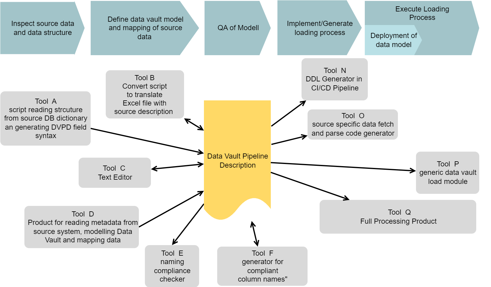
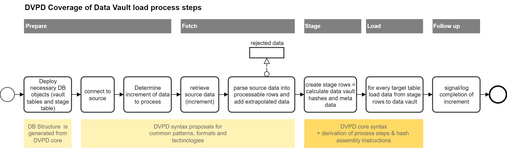
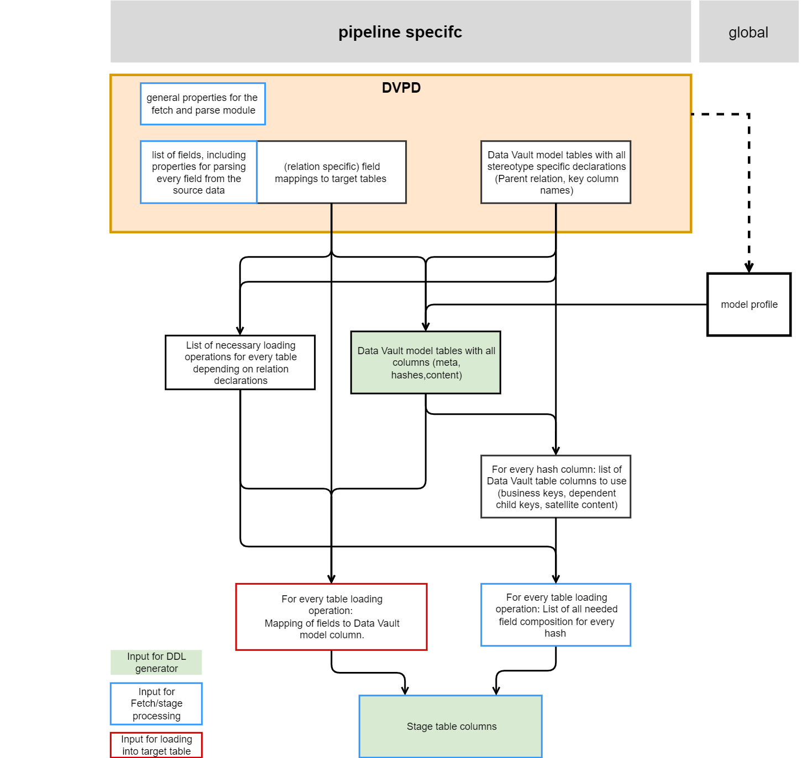
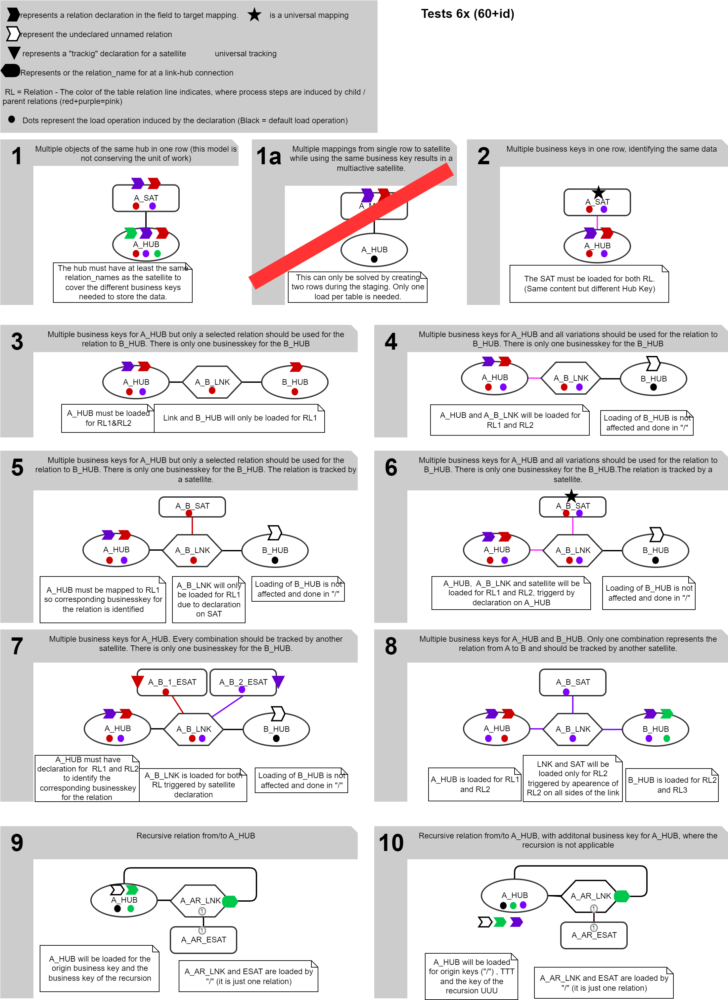

# Data Vault Pipeline Description - The Concept

## Credits and license

(C) Matthias Wegner, cimt ag

Creative Commons License [CC BY-ND 4.0](https://creativecommons.org/licenses/by-nd/4.0/)

This concept is published under the Creative Commons License CC BY-ND 4.0. 

It allows reusers to copy and distribute the material in any medium or format in **unadapted form only**, and only so long as **attribution is given to the creator**. The license allows for commercial use. So incoporating the concept into a commercial product is allowed. 

# Introduction

Most Data Warehouse Platforms have unique properties and implementations depending on available budget, technology, types of data, types of usecases. Therefore the variety of tools for analyzing, modelling and implementing Data Warehouses is large and will not get smaller in the future.

Even though the data vault approach provides a hughe leap to unifiy, generalize and standardize the modelling and loading of data, the toolset to implement data vault is fragmented and the tools often have no direct interoperability.

At cimt ag we developed and adapted multiple variants of tools and frameworks to support the modelling and loading of Data Vault, depending on the needs and capabilities of our customers. Exchangebilty of our tools between different teams/projects was very limited. One major issue was the lack of a resuable approach to describe the major asset, we always create: The Data Vault loading Process, or as we call it **"The Data Vault Pipeline"**

The Data Vault Pipeline Description concept specifies a data structure with all necessary information to generate/implement/execute a data vault loading process. The structure is independent from any technology or product. It can be created, converted and consumed by any tool, that wants to support it. This will enable development/adoption/integration/chaining of tools in the implementation process. Rather then trying to solve all problems in one tool (that either will be very expensive or might not support all steps of the implementation on the necessary level), there can be a more loosly coupled set of tools with exchangable components, depending on the individual requirements of the project.

## Take your time

Even though the overall approach of the concept is very simple, some parts might appear not very intuitive in the first reading. Please take your time to understand the requirements and solutions for the complex edge cases (especially relations). These scenarios don#t appear often, but mostly every project contains at least one source, that needs this special treatment. That's why this concept must cover theses topics.

## Version evolution

To provide a global indicator about compatibilty of a spefic toolset to the concept, the evolution of the DVPD will be structured by a release number. For the same major release number, tools should be backwards compatible. (Tools supporting 1.4 must also support 1.3, 1.2 ..., Tools supporting 2.x may not support 1.x)

## Release 0.x

Currently the concept is under development. Although many elements are already tested, there can be changes due to upcoming insights from the proof of concept implementation. This is expressed by the major release number 0. Backwardscompatibiliy will be kept the minor release and patch releases will contain changes and feature extentions.

# DVPD as information base in the ecosystem of a data vault plattform
DVPD will act as the full information base to provide and transport all the information, collected or used in the various tasks to design, implement and operate a data warehouse plattform. As there are:
- fetch and parse the source data to get information about technical structure, content and increment pattern
- design the Data Vault data model (Probably in a graphical format) 
- define the mapping of all source fields to the Data Vault tables
- add Data Vault specific columns to the table definitions (Hub/Link keys, Meta data,...)
- check the compliance of the model against conventions
- check the new parts of the model about conflicts or redundancy with the existing model
- generate ddl code and deploy the final data base objects
- implement the fetch/stage/load process 
- create/generate test cases and test data
- operate and monitor the loading processes
- monitor technical indicators about the Data Vault content (referential coherence, history depth and anomalies)
- monitor business data quality (Nothing we would define in the DVPD)

By using the DVPD as central exchange and information media, the tools are only loosly coupled. Adding or exchaning tools is more easy. Also the DVPD can be managed as an artifact, that can be versionized and processed in  CI/CD workflows (check, build, test, deploy).

## Description + Derivation = instruction
The design of DVPD focusses on the **description** of all elements, that are **not obvious** when using the data vault methodology.
Also the design allows to use only minimal declarations, when using established best practices in Data Vault modelling.

Informations, that can be derived from the minimal declaration by following the data vault method and best practices, is added by a DVDP compiler. The derivation rules are specified in this concept.

The derived informations will be provided in a Data Vault Pipeline Instruction (DVPI) Document. (DVPI is currently under development. Until its specification, the Information must be retreived from the compiler specific output interface)

# Requirements
In this chapter, we define the requirements for the DVPD to fullfill.

## Data Vault modelling standard is the base
The Data Vault modelling and loading concept define the major requirements about the necessary information, DVPD has to provide. The following Data Vault rules are taken into account, during the design:
- Data Vault Models consist of 4 major table stereotypes
    - **Hub Tables**: Keep the identification of the data objects by storing their business key columns. It is possible (but not recommended) to put additional data columns in a hub, that have no impact to the identification.
	- **Link Tables**: Represent the relations between data objects. Sometimes the link table might have additional columns(dependent child keys) to provide extra identificational data  for the relation. As like in hubs,it is also possible (but not recommended) to put additional data columns in a link, that have no impact on the identification.
	- **Satellite Tables**: Store the attributes of data objects or relations. The data is generally historized to provide former states of the data.  Depending on the source, a sattelite might contain multiple rows for the same object (multiactive sattelite). For data that will change over time or gets deleted later, the satellites are the only information source about the existence of objects and relations over time.
	- **Reference Tables**: Store simple value lookup tables to expand or translate "codes" or "names". This is also often historized to provide previous states
- Releations between Hub - Link -Sat Tables are implemented with single artificial key columns (Hub Keys, Link Keys).  The key values are determined by hashing the concatenated busineskeys/dependent child keys. To achieve consistent hash values for the same key column over different sources, there must be rules and properties for ordering of the columns
- Relations between the stereotypes can only be the following
	- Hubs don't have any releation information by themself. They only provide the Hub Key together with the business key attributes
    - A Sattelite is related to exactly one hub or one link by containing its Hub Key / Link Key
	- A Link is related to one or more hubs by containing their Hub Keys. Relations of two hubs are the most common case. Multiple relations to the same hub are also possible, representing different relations. This results into multiple columns in the link for Hub Keys of the same Hub.
	- A Reference Table does not have any relation information by itself but is joined via a content column depending on the direction of the look up transformation.
- All tables must contain essential meta data columns
    - **Load_date**: Time, when the data was loaded to the table
	- **record source**: String, describing the source system / object or the process, that generated the information
	- **load process id**: Identification of the process instance, that loaded the data to the table 
- Satellite Table might additionally contain
    - **deletion flag**: To provide explicit rows to indicate deletion of the data in the source
    - **Load End date**: To provide the Load date of the replacing record during historization. This reduces query times when determining the valid version for a given point in time 
	- **diff hash**: Hash value of all the columns in a satellite table, that have to be compared to determine if incoming data has to be inserted or is already loaded
	- **Active Record Flag** : Boolean that is set to true for the active record of every key
- Reference tables might contain
    - **Load End date**: To provide the Load date of the replacing record during historization. This reduces query times when determining the valid version for a given point in time 
	- **diff hash**: Hash value of all columns in the reference table, to determine if incoming data has to be inserted or is already loaded
- Satellites related to a link, determine the validity of the relation over time. In the common case, when a data source provides all valid relations of an object in the current load, it is necessary to mark obsolete relations as deleted, when relations change. This is achieved by declaring the Hub Keys of the loaded object as "**driving keys**"

The DVPD approach is not restricted to raw vault loading. **Business Vault** loading works the same by using the transformation/aggregation resultset as input for the staging step. 

## Scope limitation
To enforce independency between loading processes and allow highly paralellized development, one DVPD  is restricted to describe the loading of **only one tabulated dataset** (every entity is represented by one row, all rows have the same field structure). Many common data source objects (DB table, CSV files) fullfill this requirement by definition. 

The Transformation of **hierachical structured data** (XML, JSON, ...), that has to be broken down into multiple tablulated subsets, needs to be described by **one DVPD for each tabularized subset**. Handling these related DVPDs as a coupled set is not required by the DVPD concept. It is up to the implementation process, to organize necessary of grouping, by adding a custom property or with simple naming convention.

The **datavault model**, described in one DVPD, should only contain the **tables, necessary to load the source**. The overall compatibilty of modells between different DVPDs in the project must be achieved by using an appropriate modelling process/toolset and/or some automated QA cross checking during the development process. 

## Mapping capabilites
Beside the simple singluar mapping of one field to one or more data vault table columns, also the mapping of multiple fields to the same tables/columns must be supported. Common scenarios are mulitple foreign keys to the same partner, representing different relation meanings or having two seperate data sets interweaved in the same row. This also covers the description of recursive links (also known as hierachical)

A complete investigation and catalog of possible combinations is specified seperatly in

* [Catalog of field mappings in relations](./catalog_of_field_mappings_in_relations.md).
* [Data Mapping taxonomie](./data_mapping_taxonomie.md).

(Yes, it currently takes two documents to get this into perspective)

## Loading processes
Beside the pure structural description of the Data Vault model and the source data, a loading process (or at least the coding of it) needs some more information, that has to be stored in the DVPD.
To determine these requirements, the following overall phase structure of a loading process is assumed:

There are implementation approaches, that do not create a dedicated stage representation, but instead calculate all key hashes in every indivudual load directly from the source to the data vault table. Therfore using a stage table in the processesing must be optional, when using the DVDP concept. 

### Deletion detection
Detecting the deletion of data in the source, is often not as straight foreward and
intuitive as getting new and changed records. Mostly, it is not communicated at all
or only indirectly. It is an essential part of the loading process and therefore must be
describable by the DVPD.

Not every thinkable kind of deletion detection can be described by a general set of parameters. DVPD core syntax focuses on the most common patterns. More patterns can be added through the extendability. 
The following **common patterns must be supported**
- Receiving an explicit "deletion indication for an object" from the source   -> creating deletion stage records for the deleted key
- Comparing full or partitioned lists of existing business keys between source and vault -> creating deletion stage records for now missing keys
- Retreiving and staging the full or partitioned dataset -> creating deletion records by comparing stage with vault

The term "partitioned" in this context means, that only an identifiable part of the full dataset is delivered completly and can be compared. The relevant partition is identified by content in one or more columns of the source (e.g. "All contracts of a single company", "all revenues of a specific month"). These columns might not be located in the same table in the data vault model(see [Partition Deletion Detection Catalog](./partition_deletion_detection_catalog.md) for more insight ). The procedure of a partitioned deletion detection for a satellite works as follows:
- determine all keys in the satellite of active records that belong to the staged partition
- create deletion records for all of these satellite keys, when they are not in the stage table 

# Information content of the DVPD
In general terms: A DVPD contains all parameters to describe the source and target data modell and the loading process. By relying on rules and conventions of the Data Vault method, many elements needed for the loaded can be derived, which reduces the amount of declarations drastically.
With the upper requirements in mind, the folling informations need to be described in the DVPD.

- necessary elements 
	 - Basic declarations about names of meta columns, data types for hash values, hash algorhythm, hash  separator and more  = **modell profile** 
	 - data vault model on table level (name, stereotype, relation, special columns)
	 - technical transportation protocol and parameters for contacting the data source
	 - parameters for selection and configuration of an incremental loading pattern
	 - description to parse the incoming data structure into rows and fields
	 - mapping of the fields to the tables of the data vault model
	
- Optional elements, that will be needed for specific data constellations
	- Declration with field decribes wich relation, when having multiple relations to the same hub
	- Declarations for deletion detection processing

- Optional elements, that will be derived from above if not declared
	- table structure of the data vault model, column names and types
    - data content and order for calculation of all hash values

- Completly derived elements
    - structure of the staging table
	- mapping of source fields to the staging columns
	- list of process steps needed to load every target table
	- field input for the hash value calculation for every hash involved in every loading process
	- mapping of stage columns to target columns for every process step

## Basic declarations
To model and load a Data Vault, some basic decisions about general rules and conventions have to be made. These main properties have to be declared for every DVPD to allow changes over time or different settings for different environments or technologies (even within the same platform). To enforce conformity over multiple DVPDs, these settings are defined in  **model profiled**  and referenced by the DVPD. 

## data vault model on table level 
All tables in the data vault, that will be loaded by the DVPD must be declared by name, stereotype and stereotype specific properties.
- Hub: Name of the Hub Key
- Link: Name of the Link Key, names of the Hubs, related by the link. Names of relations to hubs, for hubs that are related more then one
- Satellite: Name of the Hub or Link, the Satellite is connected to, Name of the diff hash column(if used for change detection by the load module). Configuration about enddating. Relation the satellite is trackin to, when beeing an effectivity satellite
- Reference Table: Name of the diff hash column (if used for change detection by the load module).Configuration about enddating.

Just using names to reference other tables in the model, requires unique table names over all tables in the data vault model, even when distributed over different systems and technologies. If that is not applicable in the data bases, the physical table names needs to be annotated as a property of the table declarations and have to be used during DDL generation and load processing.

## technical transportation protocol
These declarations depend completly on the required method of transport. Therefore the core DVPD  will only define a property to provide the name of the fetching module. Further parameters, needed by the fetching module can be added into the DVPD. 

## Incremental pattern parameters
For fetching modules that support multiple incremental patterns or need some specification about its pattern. Names and meaning of the paramenters depend on the fetch module implementation.

## Description to parse the incoming data structure into rows and fields
For staging and mapping, the incoming data must be split up in data rows with a field structure. A field needs at least an identification/name and a data type to be used in the further process. Necessary properties to parse the field from the incoming data stream depend on the fetch or parsing module and should be declared at the field. 

## mapping of the fields to the tables of the data vault model
Every field must be mapped to one or more tables in the data vault model. This will result in equivalent columns in the target tables. Name and type of the target column might be changed by additional declarations. The participation and ordering of the field in key hashes and diff hashes can be adjusted. When multiple fields map to the same target table and column, there are multiple relations to the same object in the model and the relation, this mapping is participating, must be declared (see "declaration of relations" in the chapter "Design decistions" for the full concept)

## Definition of deletion detection processing
The methods to detect deleted entities in the source, depends on the increment pattern. All methods relyng on special retrieval and parsing of source data will need special implementations. Parameters for this depend on the execution module. For cases, where the deletion detecion can be applied by cross checking the currently staged data against the data vault content, a generic approach and set of parameters will be provided.

# Design priciple
- It is **not** the purpose of DVPD to **enforce** Data Vault standard **but** to **support** all identified varieties of it. 
- The DVPD should be selfexplaining for everybody familiar with Data Vault modelling and loading
- The description is driven primarily by the source structure. Changes to the source during the development should be easy to apply, while ensuring consistency over all tables and processes. To achieve this the data vault model will be described only on table level as far as possible.
- The most common model constallations and field mappings should be described with the least effort. This is achieved by using proper default values for many options, so you can leave out these declarations in most cases.
- It should be possible to implement plausibility checks on the DVPD
- It must be maintainable with a text editor
   - human readable and arrangable to support readablity
   - Copy/paste friendly = structure prevents accidential copy of critical properties 
- Nearly free from conventions according naming and structure in sources and targets
   - Conventions can still be enforced or applied by the toolchain (Modelling tool, Generators, code validators)
   - Not every tool in the design phase must support all necessary properties, as long as the DVPD is complete (contains all information) when it enters the Code Generation/Deployment/Execution steps.
- Parsing should be possible with a wide range of existing tools/frameworks

# Main Syntax structure

One DVDP is represented by a single json document. The root element contains general properties of the pipeline with subobjects to keep the details about fields, table model and more.

The following diagram provides an overview of the main structurural elements. Please keep in mind, that relations are an aritificial object, that is created by just referencing it from different elements. 

The naming and description of all attributes in the structure is documented in [Reference of core syntax](./Reference_of_core_syntax_elements.md)

# Design decisions

- **Table names must be unique** in the full model even if it is spread over multiple databases or database schemas. Beside of this to be a good practice for Data Vault models in general, this simplifies identfication of the tables in the various references in the DVDP and during the processing. Table names in the model are the default names for the physical table. By declaring other physical table names, a uniqueness of tables names in the physical model can be cirumvented. 
- **Parent key column names are used in child tables**. Another good practice for Data Vault models is, to use the same column name for hub/link keys in all connected child tables (links/satellites). This allows simple derivation of the key column names by using the parent relations. To prevent name collision of hub keys in the link table, it is also best practice to have unique column names for the hub/link keys over the complete model. Enforcing any naming convention here (e.g. using the unique table name of hubs and links in the column name somehow) is left over to the implemention process and toolset.
- Links, that relate multiple times to the same hub (Hierarchial Link, Same As Link) must declare a relation name for every additional reference. This name will be added to the hub key column names in the link, if not explicitly declare otherwise
- Mapping different fields from the source to the same table column in the target indicates the existence of different realtions on the same hub. Here also a more complex annotation is acceptable, since it is not the common case in data mapping.
- Basic declarations about names and types of the technical columns, hashing rules, ghost records, far future date etc. will be provided in a separate **Model profile** document. The DVPD must reference the Model Profile by its name.
- Configuration of the **Deletion Detection** is separated from the pure model definition to prevent accidential copy/paste errors. The participation of tables in the deletion detecion mechanics must be explicitly declared. Deriving the tables would lead to complex rulesets and long investigations about the behaviour, when something goes not as expected
- JSON syntax conventions
    - all objects and property names in DVPD are written in **lower case with underscores** (snake case)
	- For simple attributes and objects, key names are chosen in singular form. Only keys containing arrays are named in plural form
	- Identification of DVPD objects(tables, fields etc) in the JSON text are expressed as attributes or array elements in the JSON object and not as keys. This simplifies parsing, since there is no need to parse object names to get content. It also allows well formed JSON documents with temporarily intended inconsistencies in the DVPD during the design process of a pipeline. These inconsistencies liberate the toolchain of the design phase until the DVDP enters the compiler. 

## Relations
To map multiple source fields to the same target column, it is necessary to 
distinguish the different combinations of fields, that represent one set of 
related business keys and content columns. This is achieved with the "relation" 
concept. It is called "relation" since the need to store multiple fields in 
the same column origins from the fact, that there are multiple busniess objects
of the same kind in the source data row that are somehow related.

The relation approach defines, that all field mappings participate in one or many 
relations. This includes also all simple models, where every field participates in 
the one and only "unnamed" or implicit relation.

When multiple relation need to be distinguished there are 3 aspects, where the declaration of the relation is necessary
- Mapping of the field to the table and column
- Parent relation of a link to the hub
- Relation that an effectivity satellite will track

Declaration of explicit relations will result in additional, relation specifc hash values and relation specific loading processes.

A full investigation about the properties of Data Vault, that lead to this desing is described in [Catalog of field mappings](./catalog_of_field_mappings.md).

## Denormalizing data is out of scope
When source data contains multiple fields, which target the same satellite columns without different business keys, 
this might look like denormalized data and bring up the desire to normalize it into a multiactive satellite. 

This is not supported by the DVPD core, since Data vault highly recommends to keep the denormalized structures in the raw vault to represent the unit, allow full reconstruction of the source data and to provide full auditibility. 

Normalizing data can be done in the busniess vault. From the perspective of the DVPD, the normalization is implemented in the transformation that renders the data.
The code for the normalization might be a property in the DVPD to be used by the retrieving process.
Still, from the perspecitve of the pipeline, the data vault stage / load process expressed with the DVPD syntax starts after this transformation.

## Deletion Detection
The declaration of the deletion detection depends on the method.
- parameters for dectecting deletions during staging depend on the loading module. There will be some recommendations for common scenarios, that should be supported. Extentions or alternatives are possible and must be documented at the used module
- detection deletion by comparing the staged data to raw vault, will be defined in 3 variations
    - parameter for full set deletion detecion
	- parameters for most common partioned deletion detection (linear join pathes only)
	- SELECT statement providing all satellite keys that need to be deleted(allows any kind of complexity/ruleset)

For a more insights about the variations, when trying to define a more general approach without SQL, check out the [partition_deletion_detection_catalog](./partition_deletion_detection_catalog.md).

## Model Profile
All **basic properties of the data vault model and loading**, are defined in a model profile.
- Hashing properties
    - methods for keys and diff hashes
	- DB column data types for the keys and diff hashes
	- Constants for ghost records and missing values
	- Separator to use in the hash concatenation
- Time values for far future and far past
- Names and types for meta data columns
- Defaults about
	- Enddating in satellites
	- Historization in satelllites

These definitions might change over time or between different technical platforms. Therefore different model profiles can be declared. To support high consistency over all DVPD, model profiles are kept seperatly from the DVPD document. The DVPD must refer to at least one model profile, that will be applied to all tables in the DVDP. To allow mixing of concepts, the model profile can be declared at every table (multiplatform pipeline, load old/new style in same DVPD) 

All expected properties of the model profile are specifiend in [Model Profile reference](./reference_of_model_profile.md).

# Derivation rules for the target model and processing
DVPD minimizes the amount of declarations to describe model and load processing, by focussing on the source data structure and the target table model. This section describes how all other properties and assets, that are needed for processing, are derived from this base. That are:
- complete column list for every data vault table
- list of loading processes for every data vault table
- complete column list for a stage table
- mapping of the fields to the stage columns and data vault columns for every process
- process dependent mapping of hash columns from stage to data vault columns
- list of fields, to be used vor every hash columns
This derivation is implemented in the DVDP Compiler. Complience with these rules is essential for interoperability of different tools.

The following diagram explains the main dependencies, how elements are derived.

## Data Vault model tables ##
The following elements are derived
- columns of a table = all mapped fields deduplicated on column_name (default of target column name is the field name). Data type is column_type (default is the field type) and must be the same for all fields mapped to this target_column_name.
- business key columns = fields mapped to a hub and not explicitly excluded from  key hash
- dependend child key columns = fields mapped to a link and not explicitly excluded from key hash 
- Key column of satellites = Key column of its parent
- Hub Key columns in link = Key columns of all parents. If the parent mapping declare a relation_name but no hub_key_column_name_in_link the hub key column in the link will be the hub key column of the hub followed by an underscore and the relation name
- meta data columns are created depending on the table stereotype, model profile settings and table specific settings
	- deletion flag will be added for satellites when "has_deletion_flag" is set to true
	- load enddate column will be added when "is_endated" is set to true
	
It is recommended to group and order the columns during table creation in a convinient arragement (e.g. Meta->key->parent_key in alphabetical order ->diff hash->data columns in alphabetical order ).

## Relation participation  = load process deriviation##
Depending on the number of relations the table participates and the table stereaotype, there will be one or more load process needed. The :
- All tables with field mappings that declare a relation_name, will participate and be processed for every relation declared 
- Links with explicit relation names in the hub mappings, will only be processed once, but participate in all relations, that are declared in the mapping
- Satellites with a explicit tracking relation name, will only be processed for that relation
- When **no explicit relation** is declared for a table
  - hubs will only be processed once (unnamed relation)
  - satellites will be processed for every process of its parent, alway participating in the unnamed relation
  - links will be processed for every process of its satellites

The following figure provides a first orientation of scenarios, how processes are induced through differen declarations.

A deep investigation of scenarios is embedded in the tests, that are descibed in
[Catalog of field mappings](./catalog_of_field_mappings.md).

A compiler must be able to solve all scenarios, that are in the testset.

## Relation specific creation and mappings of hash values 
For every hash column in the target model 
- create a hash column for the stage table for every relation the target tables whith that hash column are loaded 
- the stage hash column name can be the same as the target hash column, when there is no conflict
- when multiple stage hash columns for the same target hash are needed, relation specific stage hash columns use the relation name as a postfix to the target hash column name

## Relation specific mappings 
For every relation a target table will be loaded 
- map the relation specific stage hash columns to the target hash columns
- map all fields to the target, depending on the participation of the field in the loaded relation

## Hash value field list ##
For every stage table hash column there will be a specific combination of fields to be used depending on the step, the hash column is provided for.
The list of field is determined as follows:

For every hash colunm in the model
- list all data vault columns, that have to be used for the hash
- get the process specific source fields for the data vault column from the relation specific mapping

# Final Words
As with the Data Vault method itself, this concept can become the backbone of your Data Vault implementation tool chain. Feel free to use it for your needs.

When you currently **create a Data Warehouse Platform**, the flexibility of the DVDP approach allows you to postpone tool descicions behind your first use case implementations. This shortens the time and effort for your first results and allows you to gather more project specific requirements. The selection of products, that will be integrated into your Workflow can then be done with more confidence about your needs.

**Data Warehouse Consultants** using DVPD as backbone, are able to collect and extend their portfolio of tools for the Data Warehouse implementation, while having a method to maintain collaboration between all these elements. This allows a more customer specific selection of tools including an already prepared way to adapt to products demanded by the customer.

**Data Warehouse Toolprovider** supporting the DVPD in their product, can profit, by focussing their tool to support the implementation steps, they have a unique expertise and excellence. By using DVPD as target, source or intermediate artifact, your product is combinable with other excellent tools and will be attractive to more project settings.

# Glossary

**Business key** 
One or multiple ->fields containing data that identifies a business object

**Column** 
A column in a table of the data vault model

**Dependend child key**
Dependend child key columns are columns in a link table, that are included in the calculation of the link key.

**DVPD = Data Vault Pipeline Description** 
Data Vault Pipeline Description - JSON document, describing one parsing and loading process in the specified JSON notation	

**Field** 
Smallest addressable element in the source data. Will always be processed as a unit. 

**Hub key**
The key column of a hub, calculated by hashing all business keys of a hub.

**Key column**
In the data vault model, the key columns are the relation columns to join data vault hubs, links and satellites. They contain a hash value, calculated from the business keys of the hub or all hubs and dependend child keys involved 

**Link key**
The key column of a link, calculated by hashing all business key of the related hubs and dependend child key columns of the link(when existing).
 