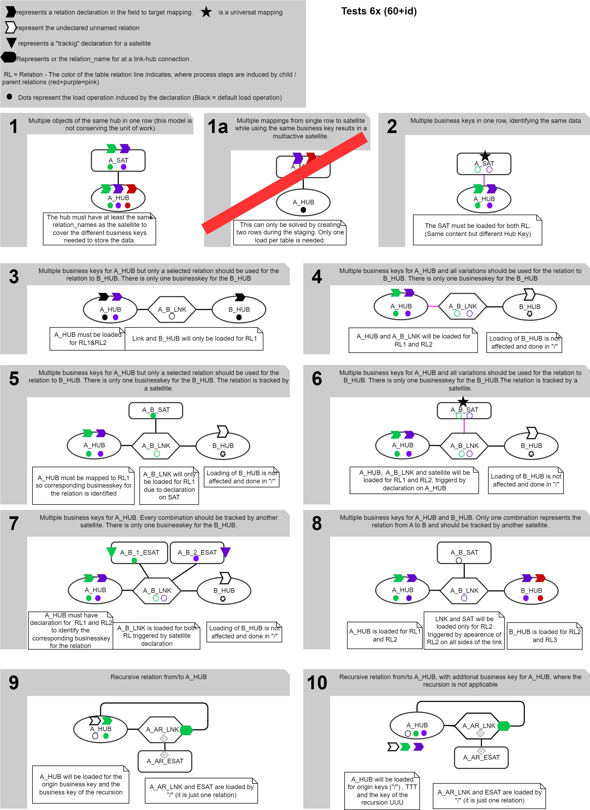

# Data Vault Pipeline Description - The Concept

## Credits and license

(C) Matthias Wegner, cimt ag

Creative Commons License [CC BY-ND 4.0](https://creativecommons.org/licenses/by-nd/4.0/)

This concept is published under the Creative Commons License CC BY-ND 4.0. 

It allows reusers to copy and distribute the material in any medium or format in **unadapted form only**, and only so long as **attribution is given to the creator**. The license allows for commercial use. So incoporating the concept into a commercial product is allowed. 

# Introduction

Most Data Warehouse Platforms have unique properties and implementations depending on available budget, technology, types of data and types of usecases. Therefore the variety of tools for analyzing, modelling and implementing Data Warehouses is large and will not get smaller in the future.

Even though the data vault approach provides a hughe leap to unifiy, generalize and standardize the modelling and loading of data, the toolset to implement data vault is fragmented and the tools often have no direct interoperability.

At cimt ag we developed and adapted multiple variants of tools and frameworks to support the modelling and loading of Data Vault, depending on the needs and capabilities of our customers. Exchangebilty of our tools between different teams/projects was very limited. One major issue was the lack of a reusable approach to describe the major asset we always create: The Data Vault loading Process, or as we call it **"The Data Vault Pipeline"**.

The Data Vault Pipeline Description is our solution, to fill taht gap. It specifies a data structure with all necessary information to generate/implement/execute a data vault loading process. The structure is independent from any technology or product. It can be created, converted and consumed by any tool, that wants to support it. This will enable development/adoption/integration/chaining of tools in the implementation process. Rather then trying to solve all problems in one tool (that either will be very expensive or might not support all steps of the implementation on the necessary level), there can be a more loosly coupled set of tools with exchangable components, depending on the individual requirements of the project.

## Take your time

Even though the overall approach of the concept is simple, some parts might not appear very intuitive in the first reading. Please take your time to understand the requirements and solutions for the complex edge cases (especially relations). 

To get a first impression of the syntax you might look into [Data Vault method coverage and syntax examples](./Data_Vault_method_coverage_and_syntax_examples.md) 

## Version evolution

To provide a global indicator about compatibilty of a spefic toolset to the concept, the evolution of the DVPD will be structured by a release number. For the same major release number, tools should be backwards compatible. (Tools supporting 1.4 must also support 1.3, 1.2 ..., Tools supporting 2.x may not support 1.x)

## Release 0.x

Currently the concept is under development. Although many elements are already tested, there can be changes due to upcoming insights from the proof of concept implementation. This is expressed by the major release number 0. 

Keyword and structural compatibiliy will be kept within the minor releases. The patch releases will contain behaviour changes, new key words and structure extentions.

# DVPD as information base in the ecosystem of a data vault plattform
DVPD will act as the full information base to provide and transport all the information, collected or used in the various tasks to design, implement and operate a data warehouse plattform. As there are:
- fetch and parse the source data to get information about technical structure, content and increment pattern
- design the Data Vault data model (Probably in a graphical format) 
- define the mapping of all source fields to the Data Vault tables
- add Data Vault specific columns to the table definitions (Hub/Link keys, Meta data,...)
- check the compliance of the model against conventions
- check the new parts of the model about conflicts or redundancy with the existing model
- generate ddl code and deploy the final data base objects
- implement the fetch/stage/load process 
- create/generate test cases and test data
- operate and monitor the loading processes
- monitor technical indicators about the Data Vault content (referential coherence, history depth and anomalies)

By using the DVPD as central exchange and information media, the tools are  loosly coupled. Adding or exchaning tools is more easy. Also the DVPD can be managed as an artifact. It can be versionized and processed in  CI/CD workflows (check, build, test, deploy).

## Description + Derivation = instruction (DVPI)
The design of DVPD focusses on the **declartion of all elements, that are not obvious**. Every element that can be derived by following the the data vault methodology can be omitted in the declaration.
Also the design allows to use only minimal declarations, when using established best practices in Data Vault modelling.

Information, that can be derived from the minimal declaration by following the data vault method and best practices, is added by a **DVDP compiler**(dvpdc). The derivation rules are specified in this concept.

The derived information should be provided in a Data Vault Pipeline Instruction (DVPI) Document. 

### Data Vault Pipeline Instruction
The Data Vault Pipeline Instruction is the resultset of a DVPD compiler and contains the complete sets of declarations, for every processing step.
- list of data vault tables (ready to generate DDL)
    - stereotype
	- properties (e.g. if multiactive)
	- relation to other tables
	- all columns (meta, hashes, content)
- general source fetching properties
- general source parsing properties
- list of fields and parsing properties for every field
- stage table columns (hashes, content, ready to generate DDL) 
- list of hash values (keys, diff hashes), that need to be calculated
    - fields needed for the hash key
	- hints to ensure a consistent order of fields 
- list of loading operations
	- data vault table to load 
	- mapping of fields to stage colunm and target column 
	- mapping of hashes to stage colunm and target columns

It is up to the implementation approach of the loading process, if a stage table is used as an intermediate image. DVDP/DVPI does not 
require the use of stage tables but provides the structure for implementations that do need it.

It is also the responsibility of the code generator/execution engine to define the usage of field ordering hints for the hash calculation. It is recommended to adjust the DVDP compiler, to provide warnings, when syntax features for the ordering of hash content have been used in the DVPD but are not supported by the execution.

(In futere releases the dvpi will provide a list of all used keywords
so the conusmer can check it support more easy)

# Requirements
In this chapter, we define the requirements for the DVPD to fullfill.

## Data Vault modelling standard is the base
The Data Vault modelling and loading method drive the major requirements about the necessary information, DVPD has to provide. The following Data Vault rules are taken into account:
- Data Vault Models consist of 4 major table stereotypes
    - **Hub Tables**: Keep the identification of the data objects by storing their business key columns. It is possible (but not recommended) to put additional data columns in a hub, that have no impact to the identification.
	- **Link Tables**: Represent the relations between data objects. Sometimes the link table might have additional columns (dependent child keys) to provide extra identificational data  for the relation. As like in hubs, it is also possible (but not recommended) to put additional data columns in a link, that have no impact on the identification.
	- **Satellite Tables**: Store the attributes of data objects or relations. The data is generally historized to provide former states of the data.  Depending on the source, a sattelite might contain multiple active rows for the same object (multiactive sattelite). For data that will change over time or gets deleted later, the satellites are the only information source about the existence of objects and relations over time.
	- **Reference Tables**: Store simple value lookup tables to expand or translate "codes" or "names". This is also often historized to provide previous states
- Relations between Hub - Link - Sat Tables are implemented with single **artificial key columns** (Hub Keys, Link Keys).  The key values are determined by hashing the concatenated business keys/dependent child keys. To achieve consistent hash values for the same key column over different sources, there must be rules and properties to declare the ordering of the columns.
- **Connections between the stereotypes** can only be the following
	- **Hubs** don't have any connection to other tables. They only contain the Hub Key together with the business key attributes
	- A **Link** is connected to one or more hubs by containing their Hub Keys.  Multiple connections to the same hub are also possible, representing **different relations** or **recursive relations**. This results into multiple columns in the link for Hub Keys of the same Hub.
    - A **Sattelite** is connected to exactly one hub or one link by containing its Hub Key / Link Key
	- A **Reference** Table does not have any connection information by itself but is joined via a content column depending on the direction of the look up transformation.
- All tables must contain essential meta data columns
    - **Load_date**: Time, when the data was "inserted physically to the database" (DV Book 11.3) *see Annotation (1)*
	- **record source**: String, describing the source system / object or the process, that generated the information
	- **load process id**: Identification of the process instance, that loaded the data to the table 
- Satellite Table might additionally contain
    - **deletion flag**: boolean to provide explicit rows to indicate deletion of the data in the source
    - **Load End date**: To provide the Load date of the replacing record during historization. This reduces query times when determining the valid version for a given point in time.  
	- **diff hash**: Hash value of all the columns in a satellite table, that have to be compared to determine if incoming data has to be inserted or is already loaded
	- **active record flag** : Boolean that is set to true for the active record(s) of every key
- Satellites of links
    - might represent only the validity of the link relation they are connected to  = *effectivity sattellite*. They contain no data colunms.   
    - Might be loaded / historized by following **driving keys**. They are used to determine, which relations need to be ended, when relations change for the specified key.
- Reference tables might contain
    - **Load End date**: To provide the Load date of the replacing record during historization. This reduces query times when determining the valid version for a given point in time 
	- **diff hash**: Hash value of all columns in the reference table, to determine if incoming data has to be inserted or is already loaded
 
*Annotation(1) about Load_Date: There are neverending discussions in the data vault community, how to interpret this sentence from Dan Linstedt. It is up to the implementation of the loading process, to decide what time is stored here. DVPD will have no influence on this.*

*Annotation(2) about driving keys: Following a driving key is a property of a satellite. The driving keys for 
a satellite must always be the same in all loading pipelines, that insert data in the satellite, since the sattellite expresses a specific relation*

The DVPD approach is not restricted to raw vault loading. **Business Vault** loading works the same by using the transformation/aggregation resultset as input for the staging step. 

## Source structure, parsing and mapping capabilites
Describing the structure of the source data and how to map the incoming fields into the data vault model is the second major feature, that needs to be provided by the DVPD.
Since DVPD will focus only to tabularized data (as discussed in "Scope Limitation" below), this boils down to a simple list containing
- field name
- field type
- properties how to parse the field from the source data format
- the mapping to the target table(s)

Beside the simple singluar mapping of one field to one or more data vault table columns, a mapping of multiple fields to the same tables/columns must be supported. Common scenarios for this are multiple foreign keys that are mapped to the same partner object, representing different relation meanings. This also covers the description of recursive links (also known as hierachical)
In some cases also two seperate data sets might be interweaved in the same row. 

A complete investigation and catalog of possible combinations is specified seperatly in

* [Catalog of field mappings in relations](./catalog_of_field_mappings_in_relations.md).
* [Model topologies and basic field mapping variations](./Model_topologies_and_basic_field_mapping_variations.md).

(Yes, it currently takes two documents to get this into perspective)

## Loading processes
In addition to the structure, mapping and parsing description,  processing specific declarations are needed for the loading process (or at least the coding of it).
To determine the requirements for the loading process, the following overall phase structure assumed:

Depending on the flexibility of the code generators or execution engine the necessary properties can vary. The major aspects are the following:
- selection and behaviour of the incremental loading pattern
- general settings for parsing
- rejection handling

The DVPD should **not** contain configuration properties regarding resources. Those might be changed, due to changes in the infrastructure (file pathes, urls, connection parameters) or operational patterns (logging method, monitoring).
These should be managed by normal configuation concepts (e.g. loading of property files at runtime, environment variables) or by changing  the code generator/execution engine.

### Deletion detection
Deletion detection is necessary for every source that
- deletes data from its own dataset
- does **not** provide explicit and reliable information about the deletion of objects in the interface

In contrast, when deletion events are explicitly delivered the parsing module is responsible 
for the interpretation and transformation into deletion flagged data rows in the data vault. 

Without explicit deletion information, the method of detecting the deletion of data in the source
needs some extra processing. The proper method depends on the available delivery pattern of the source 
(full / incremental / partitioned). In general, data sources with high volume, will be delivered
incrementally or partitioned to minimize the effort for every load. 

Not every theoretically possible kind of deletion detection 
can be described by a general set of parameters, since the possible varations are nearly endless.
DVPD core syntax focuses on the most common patterns. 
More patterns can be added through the extendability. 
The following common patterns must be supported
- **Comparing full or partitioned lists of** existing **business keys** between source and vault &rarr; creating deletion stage records for now missing keys
- Retreiving and staging the **full or partitioned dataset** &rarr; creating deletion records by comparing stage with vault

The term "partitioned" in this context means, that only an identifiable part of the full dataset is delivered completely and can be compared. The relevant partition is identified by content in one or more fields of the source (e.g. "All contracts of a single company", "all sales of a specific month").
The procedure of a partitioned deletion detection for a satellite works as follows:
- collect all keys in the satellite of active records that belong to the staged partition
- create deletion records for all of collected satellite keys, when they are not in the stage table 

A deeper investigation about patterns of deletion detection is provided in
 [Deletion Detection Catalog](./deletion_detection_catalog.md).

## Scope limitation
To enforce independence between loading processes, allowing highly paralellized development and to keep things simple, 
one DVPD is restricted to describe the loading of **only one tabulated dataset** (every entity is represented by one row,
all rows have the same field structure). Many common data source objects (DB table, CSV files) fullfill this requirement by definition. 

Currently (0.6.x), the Transformation of **hierachical structured data** (XML, JSON, ...), that has to be broken
down into multiple tablulated subsets, needs to be described by **one DVPD for each tabularized subset**. 
This will we extended to "one DVPD for each source object" in 0.7.0.

The **datavault model**, described in one DVPD, should only contain the **tables, necessary to load the source**. The 
overall compatibilty of modells between different DVPDs in the project must be achieved by using an appropriate 
modelling process/toolset and/or some automated QA cross checking during the development process. (Future 
Versions of DVPD will provide a property, to declare the maturity of the DVPD. This can be used during the model
crosscheck to distinguish between established parts of the model and parts currently under construction.)

# Information content of the DVPD
In general terms: A DVPD contains all declarations to describe the source and target data model and the loading process.
By relying on rules and conventions of the Data Vault method, many elements needed for the loading can be derived, which
reduces the amount of declarations drastically.
With the above requirements in mind, the following information needs to be described in the DVPD:

- necessary elements 
	 - Basic declarations about names of meta columns, data types for hash values, hash algorhythm, hash  separator and more  = **model profile** 
	 - data vault model on table level (name, stereotype, relation, special columns)
	 - technical transportation protocol and parameters for contacting the data source
	 - parameters for selection and configuration of an incremental loading pattern
	 - description to parse the incoming data structure into rows and fields
	 - mapping of the fields to the tables of the data vault model
	
- Optional elements, that will be needed for specific data constellations and sources
	- Declaring which field contributes in wich relation, when having multiple relations to the same hub
	- Declarations for deletion detection processing

- Optional elements, that will be derived from above if not declared
	- table structure of the data vault model, column names, types and data vault column classes (business key, content)
    - data content and order indicatores for the calculation of the hash values
	- name of staging columns

- Completely derived elements
    - structure of the staging table
	- mapping of source fields to the staging columns
	- list of load operations needed to load every target table
	- field input for the hash value calculation for every hash involved in every loading operation
	- mapping of stage columns to target columns for every loading operation

## Basic declarations
To model and load a Data Vault, some basic decisions about general rules and conventions have to be made. These main
properties have to be declared for every DVPD. This allows changes over time or different settings for different 
environments or technologies (even within the same platform). To enforce conformity over multiple DVPDs, these settings 
are defined in a **model profile**  and referenced by the DVPD. 

## Data vault model on table level 
All tables in the data vault, that will be loaded by the DVPD, must be declared by name, stereotype and stereotype specific properties.
- Hub: Name of the Hub Key
- Link: Name of the Link Key, names of the Hubs, related by the link. Names of relations to hubs, for hubs that are related more then once
- Satellite: Name of the Hub or Link, the Satellite is connected to, Name of the diff hash column (if used for change detection by the load module). Configuration about enddating. Relation the satellite is  loaded for.
- Reference Table: Name of the diff hash column (if used for change detection by the load module). Configuration about enddating.

Just using names to reference other tables in the model, requires unique table names over all tables in the data vault model, even when distributed over different systems and technologies. If that is not applicable in the databases, the physical table names can be annotated as a property of the table declarations and have to be used during DDL generation and load processing.

## Technical transportation protocol
These declarations depend completely on the required method of transport. Therefore the core DVPD  will only define a property to provide the name of the fetching module. Further parameters, needed by the fetching module can be added into the DVPD. 

## Incremental pattern parameters
For fetching modules that support multiple incremental patterns or need some specification about its pattern. Names and meaning of the paramenters depend on the fetch module implementation.

## Description to parse the incoming data structure into rows and fields
For staging and mapping, the incoming data must be split up in data rows with a field structure. A field needs at least an identification/name and a data type to be used in the further process. Necessary properties to parse the field from the incoming data stream depend on the fetch or parsing module and should be declared at the field. 

## mapping of the fields to the tables of the data vault model
Every field must be mapped to one or more tables in the data vault model. This will result in equivalent columns in the target tables. Name and type of the target column might be changed by additional declarations. The participation and ordering of the field in key hashes and diff hashes can be adjusted. When multiple fields map to the same target table and column, there are multiple relations to the same object in the model. These relations must be declared explicitly (see "declaration of relations" in the chapter "Design decisions" for the full concept).

## Definition of deletion detection processing
Deletion detection, identifies the removal of data from the source.

The methods to detect deleted entities in the source depends on the increment pattern of the data source. 
All methods relying on special retrieval and parsing of source data will need special implementations. 
Parameters for this depend on the execution module. For cases, where the deletion detecion can 
be applied by cross checking the currently staged data against the data vault content, 
a generic approach and set of parameters will be provided.

# Design principle
- It is **not** the purpose of DVPD to **enforce** Data Vault standard **but** to **support** all identified varieties of it. 
- The DVPD should be self explaining for everybody familiar with Data Vault modelling and loading
- The description is driven primarily by the source structure. Changes to the source during the development should be easy to apply, while ensuring consistency over all tables and processes. To achieve this the data vault model will be described only on table level as far as possible.
- The most common model constallations and field mappings should be described with the least effort. This is achieved by using proper default values for many options, so you can leave out these declarations in most cases.
- It should be possible to implement plausibility checks on the DVPD
- It must be maintainable with a text editor
   - human readable and arrangable to support readability
   - Copy/paste friendly = structure prevents accidential copy of  properties that can be critical, without further review
- Nearly free from conventions according naming and structure in sources and targets
   - Conventions can still be enforced or applied by the toolchain (Modelling tool, Generators, code validators)
   - Not every tool in the design phase must support all necessary properties, as long as the DVPD is complete (contains all information) when it enters the Code Generation/Deployment/Execution steps.
- Parsing should be possible with a wide range of existing tools/frameworks

# Main Syntax structure

One DVDP is represented by a single json document. The root element contains general properties of the pipeline with subobjects to keep the details about fields, table model and more.

The following diagram provides an overview of the main structural elements. Please keep in mind that relations are aritificial objects, that are created by just referencing them from different elements. 

The naming and description of all attributes in the structure is documented in [Reference of core syntax](./Reference_of_core_syntax_elements.md)

# Design decisions

## Direction of the mapping declaration
**Dvpd describes the mapping by taking the source structure and distributing every field  to the target model** 

Why?

The target model often has the same column names and types like the source. Source metadata can often be read out, so a basic declaration of the source can be generated.
Just adding some annotations for the mapping, keeps the effort small and supports the "source driven" implementation workflow. 
- read source structure and generate field list
- add mapping annotation for every field
- add model on table level
- done

The source driven mapping approach also allows an efficient declaration of "relation specific" mappings (see below).

**How do you enforce consistency of Hub columns, when different sources have different names for the business key fields ?**

Consistency of the overlapping tables between different DVPDs must be enforced by the build pipeline. It is no concern of the DVPD syntax.

**Why is Dvpd core syntax not designed to represent the full linage including formulas for calculation from source fields?**

The assembly of a value/measure/KPI can be arbitrary complex and can't be represented efficiently in a way, that is translatable into executable code. Therefore Dvpd definition begins behind the calculation. Nevertheless, since DVPD is extendable, annotational syntax can be added to provide and conserve linage information (probably on field level).

## Syntax design
- **Table names must be unique** in the full model even if it is spread over multiple databases or database schemas. Besides beeing good practice for Data Vault models in general, this simplifies the identification of tables referenced in the DVDP and during processing. Table names in the model are the default names for the physical table. By declaring other physical table names, a uniqueness of tables names in the physical model can be circumvented. 
- **Parent key column names are default in child tables**. Another good practice for Data Vault models is, to use the same column name for hub/link keys in all connected child tables (links/satellites). This allows simple derivation of the key column names by using the parent relations. To prevent name collision of hub keys in the link table, it is also best practice to have unique column names for the hub/link keys over the complete model. Enforcing any naming convention here (e.g. using the unique table name of hubs and links in the column name somehow) is left over to the implemention process and toolset. Breaking this approach will be achievable with more declaration
- Mapping different fields from the source to the same table column in the target indicates the existence of different relations on the same hub. Since this is a rare case in data mapping, a more complex annotation is acceptable here.
- Links, that relate multiple times to the same hub (Hierarchial Link, Same As Link) must declare a relation name for every additional reference. This name will be added to the hub key column names in the link, if not explicitly declare otherwise
- Basic declarations about names and types of the technical columns, hashing rules, ghost records, far future date etc. will be provided in a separate **Model profile** document. The DVPD must reference the Model Profile by its name.
- Configuration of the **Deletion Detection** is separated from the  model definition to prevent accidential copy/paste errors. The participation of tables in the deletion detecion  must be explicitly declared. Deriving the tables would lead to complex rulesets and long investigations about the behaviour, when something doesn't go as expected
- JSON syntax conventions
    - all objects and property names in DVPD are written in **lower case with underscores** (snake case)
	- For simple attributes and objects, key names are chosen in singular form. Keys containing arrays are named in plural form
	- Identification of DVPD objects (tables, fields etc) in the JSON text are expressed as attributes or array elements in the JSON object and not as keys. This simplifies parsing, since there is no need to parse object names to get content. It also allows well formed JSON documents with temporarily intended inconsistencies in the DVPD during the design process of a pipeline. These inconsistencies liberate the toolchain of the design phase until the DVDP enters the compiler. 
	- Identification of objects in the DVPI are expressed as keys. This assures the uniqueness of the objects and allows immediate access to the properties of the objects during interpretation of the DVPI. 

## Relation specific mappings
Some source data contains multiple relations between the same objects at the same time (e.g. a contract with a customer receiving the service and another customer paying for it). 

In the transformation description, multiple source fields must be mapped to the same target columns (e.g. the two different customer numbers). 
This is achieved with the "relation" syntax approach.

The relation approach defines, that every field mapping participates in one or many relations. As long, as there is no explicit relation
declaration at a field mapping, it participates in the "unnamed" relations.

When multiple relations need to be distinguished, there are 3 aspects where the declaration of the relation is necessary
- Mapping of the field to the table and column
- Parent connection from a link to the hub
- Relation a satellite will track

Tables need to be loaded for all relations, their mapped fields are mapped in or directly connected tables participate. There must be exactly one mapping to a target column for every relation of the table.

Declaration of explicit relations will result in additional, relation specific hash values and relation specific loading operations.

A full investigation about the properties of Data Vault, that lead to this desing is described in [Catalog of field mappings](./catalog_of_field_mappings.md).

## Denormalizing data is out of scope
When source data contains multiple fields, which target the same satellite columns without different business keys, 
this might look like denormalized data and bring up the desire to normalize it into a multiactive satellite. 

This is not supported by the DVPD core, since Data vault highly recommends to keep the denormalized structures in the raw vault to express the unit of work, allow full reconstruction of the source data and to provide full auditibility. 

When normalized data is provided the normalization is implemented in the transformation that renders the normalized dataset.
The code for the normalization might be a property in the DVPD, used by the retrieving process, but from the perspecitve of the pipeline, the data vault stage / load process expressed with the DVPD syntax starts behind this transformation.

## Deletion Detection
The declaration of the deletion detection depends on the method.
- parameters for dectecting deletions during staging depend on the loading module. There will be some recommendations for common scenarios, that should be used when supported. Extentions or alternatives are possible and must be documented at the used module
- deletion detection by comparing the staged data to raw vault, will be defined in 3 variations
    - parameter for full set deletion detection
	- parameters for most common partioned deletion detection (linear join paths only)
	- SELECT statement providing all satellite keys that need to be deleted (allows any kind of complexity/ruleset)

For more insights about the variations, when trying to define a more general approach without SQL, check out the [deletion_detection_catalog](./deletion_detection_catalog.md).

## Model Profile
All **basic properties of the data vault model and loading**, are defined in a model profile.
- Hashing properties
    - methods for keys and diff hashes
	- DB column data types for the keys and diff hashes
	- separator to use in the hash concatenation
- Constants for ghost records and missing values
- Time values for far future and far past
- Names and types for meta data columns
- Defaults
	- method of change detection in satellites
	- if enddating is used in satellites

These definitions might change over time or between different technical platforms. Therefore different model profiles can be declared. To support high consistency over all DVPDs, model profiles are kept separately from the DVPD document. The DVPD must refer to at least one model profile, that will be applied to all tables in the DVDP. To allow mixing of concepts, the model profile can also be declared at every table (multiplatform pipeline, load old/new style in same DVPD) 

All expected properties of the model profile are specifiend in [Model Profile reference](./reference_of_model_profile.md).

# Derivation rules for the target model and processing
DVPD minimizes the amount of declarations to describe model and load processing, by focussing on the source data structure and the target table model. This section describes how all other properties and assets, that are needed for processing, are derived from this base. That are:
- complete column list for every data vault table
- list of loading operations for every data vault table
- complete column list for a stage table
- mapping of the fields to the stage columns
- mapping of hashes/fields/stage columns to data vault columns for every loading operation
- list of fields, to be used for every hash column
This derivation is implemented in the DVPD Compiler. Compliance with these rules is essential for interoperability of different tools.

The following diagram explains the general dependencies, how elements are derived.

## Data Vault model tables ##
The following elements are derived
- columns of a table = all mapped fields deduplicated on column_name (default of target column name is the field name). Data type is column_type (default is the field type) and must be the same for all fields mapped to this target_column_name.
- business key columns = fields mapped to a hub and not explicitly excluded from key hash
- dependend child key columns = fields mapped to a link and not explicitly excluded from key hash 
- Key column of satellites = Key column of its parent
- Hub Key columns in link = Key columns of all parents. If the parent mapping declares a relation_name but no explicit hub_key_column_name_in_link the hub key column name in the link will be the hub key column name in the hub followed by an underscore and the relation name
- meta data columns are created depending on the table stereotype, model profile settings and table specific settings
	- deletion flag will be added for satellites when "has_deletion_flag" is set to true
	- load enddate column will be added when "is_endated" is set to true
	
It is recommended to group and order the columns during table creation in a convinient arragement (e.g. Meta->key->parent_key in alphabetical order ->diff hash->data columns in alphabetical order ). The compiler provides all these classifications. It is the responsibility of the DDL generator to use them wisely.

## Relation participation  = load operation deriviation
Depending on the number of relations the table participates in and the table stereotype, there will be one or more load processes needed. 
- All tables with field mappings that declare a relation_name, will participate and be loaded for every relation found in the mappings to the table 
- Links with explicit relation names in the hub mappings will only be processed once, but use the business key fields participating in the declared relations
- When **no explicit relation** is declared for a table
  - hubs and satellites will be loaded once
  - links will be processed for every load operation of their satellites using the hashes based on the business keys for that relation

The following figure provides a first orientation of scenarios, how processes are induced through different declarations.

A deep investigation of scenarios is embedded in the tests, that are descibed in
[Catalog of field mappings](./catalog_of_field_mappings.md).

A compiler must be able to solve all scenarios, that are in the testset.

## Relation specific creation and mappings of hash values 
For every hash column (hub keys for hubs, link keys for link, diff hashes for satellites and reference tables) in the target model 
- for every relation of a load operation, this hash is involved
	- assemble a unique hash name (e.g. type_table_relation) that will be used to address the hash in the mappings
	- determine the fields, that have to be concatenated
	- create a stage hash column name (if not already declared)
		- can be the same as the target hash column, when there is no conflict
		- when multiple stage hash columns for the same target hash are needed, relation specific stage hash columns use the relation name as a postfix to the target hash column name

For implementations, that are not using stage tables, the stage hash column names can be omitted.

## Load operation specific mappings 
For every load operation of a target table
- map the relation specific hash columns to the target hash columns
- map all fields to the target, depending on the participation of the field in the loaded relation

# Final Words
As with the Data Vault method itself, this concept can become the backbone of your Data Vault implementation tool chain. Feel free to use it for your needs.

When you currently **create a Data Warehouse Platform**, the flexibility of the DVDP approach allows you to postpone tool descicions behind your first use case implementations. This shortens the time and effort for your first results and allows you to gather experience and more project specific requirements. The selection of products, that will be integrated into your workflow can then be done with more confidence about your needs.

**Data Warehouse Consultants** using DVPD as backbone, are able to collect and extend their portfolio of tools for the Data Warehouse implementation, while having a method to maintain collaboration between all these elements. This allows a more customer specific selection of tools including an already prepared way to adapt to products demanded by the customer.

**Data Warehouse Toolprovider** supporting the DVPD in their product, can profit, by focussing their tool to support the implementation steps, they have a unique expertise and excellence. By using DVPD as target, source or intermediate artifact, your product is combinable with other excellent tools and will be attractive to more project setups.

# Glossary

**Business key** 
One or multiple &rarr; fields containing data that identifies a business object

**Column** 
A column in a table of the data vault model

**Dependend child key**
Dependend child key columns are columns in a link table, that are included in the calculation of the link key.

**DVPD = Data Vault Pipeline Description** 
Data Vault Pipeline Description - JSON document, describing one parsing and loading process in the specified JSON notation	

**Field** 
Smallest addressable element in the source data. Will always be processed as a unit. 

**Hub key**
The key column of a hub, calculated by hashing all business keys of a hub.

**Key column**
In the data vault model, the key columns are the relation columns to join data vault hubs, links and satellites. They contain a hash value, calculated from the business keys of the hub or all hubs and dependend child keys involved 

**Link key**
The key column of a link, calculated by hashing all business keys of the related hubs and dependend child key columns of the link(when existing).
 
**Load Operation**
A table load operation contains all necessary steps for loading a defined set of fields to a single data vault table. This can be a single SQL Insert Statement or a more complex series of Statemets (e.g. check Hash collision, insert new and changed data, insert deletion records, update enddate columns)

**Process**
The process contains all tasks, that are needed to load the whole desribed transformation.
- determine increment
- fetch data 
- parse data into rows and fields
- calculate hash values (can also be part of the load operation)
- execute all load operations for all tables with the fetched data

**Relation**
A relation between two business objects. Relations in data vault are expressed via link table structures. The same business objects can have multiple kinds of relations between each other. As soon, as there is more then one kind of relation between the same objects, it is necessary to provide multiple connections and explicit names for the relation. see [Catalog of field mappings](./catalog_of_field_mappings_in_relations.md) for more insights
