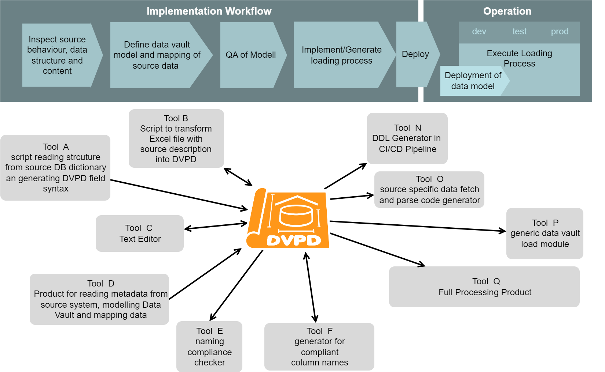

# Data Vault Pipeline Description - The Concept
(C) Matthias Wegner, cimt ag

Creative Commons License [CC BY-ND 4.0](https://creativecommons.org/licenses/by-nd/4.0/)

# Introduction

Most Data Warehouse Platforms have unique properties and implementations depending on available budget, technology, types of data, types of usecases. Therefore the variety of tools for analyzing, modelling and implementing Data Warehouses is large and will not get smaller in the future.

Even though the data vault approach provides a hugh leap to unifiy, generalize and standardize the modelling and loading of data, the toolset to implement data vault is fragmented and has mostly no interoperability.

At cimt ag we developed and adapted multiple variants of tools and frameworks to support the modelling and loading of Data Vault, depending on the needs and capabilities of our customers. Exchangebilty of our tools between different teams/projects was very limited. One major issue was the lack of an independent approach to describe the major asset, we always create: **The Data Vault Pipeline**

This concept defines a data structure with all necessary information to generate/implement/execute a data vault loading process. The structure is independent from any technology or product. It can be produced, converted and consumed by any tool, that wants to support it. This will enable development/adoption/integration/chaining of tools that focus on specific steps in the implementation process. Rather then trying to solve all problems in one tool (that either will be very expensive or might not support all steps of the implementation on the necessary level), there will be a more loosly coupled set of tools with exchangable components, depending on the individual requirements of the project.

## Take your time

Even though the overall approach of the concept is very simple, some parts might appear not very intuitive in the first reading. Please take your time to understand the requirements and solutions for the complex edge cases (field groups, recursive links). Even though, these scenarios dont appear often, mostly every project contains at least one source, that needs this special treatment. Therefore this concelt must cover theses topics.

## Release 0.x

Currently the concept is under development. Even though many elements are already tested, there can be some minor changes due to upcoming insights from the proof of concept implementation. The major release number 0 indicates, that changes are not backward compatible.

To provide a global indicator about compatibilty of a spefic toolset to the concept, the evolution of the DVPD will be structured by a release number. For the same major release number, tools should be backward compatible. (Tools supporting 1.4 must also support 1.3, 1.2 ... but not 2.0)

## License
This concept is published under the Creative Commons License CC BY-ND 4.0. 

It allows reusers to copy and distribute the material in any medium or format in **unadapted form only**, and only so long as **attribution is given to the creator**. The license allows for commercial use. So incoporating the concept into a commercial product is allowed. 

# DVPD as information base in the ecosystem of a data vault plattform
DVPD will act as the full information base to provide and transport all the information, collected or used in the various tasks to design, implement and operate a data warehouse plattform. As there are:
- fetch and parse the source data to get information about technical structure, content and increment pattern
- Design the Data Vault Model. Probably in a graphical form. 
- Define the mapping of all source fields to the Data Vault tables
- Add Data Vault specific columns to the table definitions (Hub/Link keys, Meta data,...)
- Check the model regarding compliance to conventions
- Check the new parts of the model about conflicts or redundancy with the existing model
- Generate ddl and deploy the final data base objects
- Implement the fetch/stage/load process 
- Create/Generate test cases/ test data
- Operate and monitor the loading processes
- Monitor technical indicators about the Data Vault content (Referential coherence, history depth and anomalies)
- Monitor business data quality (Nothing we would define in the DVPD)

By using the DVPD as central exchange and information media, the tools are more loosly coupled. Adding or exchaning tools is more easy. Also the DVPD can be managed as an artifact, that can be versioned and processed in  CI/CD workflows (Testing, deployment).

# Requirements
In this chapter, we define the requirements for the DVPD to fullfill.

## Data Vault is the base
The Data Vault modelling and loading concept define the major requirements about the necessary informataion, DVPD has to provide. The following Data Vault rules are taken into account, during the design:
- Data Vault Models consist of 4 main table stereotypes
    - **Hub Tables**: Keep the identification of the data objects by storing their business key columns. It is not forbidden (but not recommended) to put additional data columns in a hub,that have no impact to the identification.
	- **Link Tables**: Represent the relations between data objects. Sometimes the link table might have additional columns to provide extra identificational data  for the relation, that is not creating a new business object(dependent child keys). As like in hubs,it is not forbidden (but not recommended) to put additional data columns in a link, that have no impact on the identification.
	- **Satellite Table**: Store the attributes of data objects or relations. The data is generally historized to provide former states of the data.  Depending on the source, a sattelites might contain multiple rows for the same object (multiactive sattelite). For data that will change over time or gets deleted later, the satellites are the only information source about the existence of objects and relations over time.
	- **Reference Table**: Store simple value lookup tables to expand or translate "codes". This is also often historized to provide former states
- Releations between Hub - Link -Sat Tables are implemented with single artificial key columns (Hub Keys, Link Keys).  The key values are determined by hashing the concatenated busineskeys/dependent child keys. To achieve consistent hash values for the same key column over different sources, there must be rules and properties for ordering of the columns
- Relations between the stereotypes can only be the following
	- Hubs don't have any releation information by itself. They only provide the Hub Key together with the business key attributes
    - A Sattelite is related to exacly one hub or one link by containing its Hub Key / Link Key
	- A Link is related to one or more hubs by containing their Hub Keys. Relations of two hubs are the most common case. Multiple relations to the same hub are also possible (recursive relation) resulting in multiple columns in the link for Hub Keys of the same Hub.
	- A Reference Table does not have any relation information by itself but is joined via the content column depending on the direction of the look up transformation.
- All Tables must contain essential meta data columns
    - **Load_date**: Time, when the data was loaded to a specific table
	- **record source**: String, describing the source system / object / media of the data
	- **load process id**: Identification of the process instance, that loaded the data to the table
- Satellite Table might contain also 
    - **deletion flag**: To provide explicit rows to indicat deletion of data in the source
    - **Load End date**: To provide the Load date of the replacing record during historization. This reduces query times when determining the valid version for a given point in time 
	- **diff hash**: Hash value of all columns in a satellite table, that have to be compared to determine if incoming data has to be inserted or is already loaded
- Referenct tables might contain
    - **Load End date**: To provide the Load date of the replacing record during historization. This reduces query times when determining the valid version for a given point in time 
	- **diff hash**: Hash value of all columns in the reference table, to determine if incoming data has to be inserted or is already loaded
- Satellites releated to a link, determine the validity of the relation over time. In the common case, when a data source provides all valid relations of an object in the current load, it is necessary to mark obsolete relations as deleted, when relations change. This is achieved by declaring the Hub Keys of the loaded Object as "**driving keys**"

The DVPD approach is not restricted to raw vault loading. **Business Vault** loading works the same by using the transformation/aggregation resultset as input for the staging step. 

## Scope limitation
To enforce independency between loading processes and allow highly paralellized development, one DVPD  is restricted to describe the loading of only **one tablulated dataset** (every entity is represented by one row, all rows have the same field structure). Many common data source objects (DB table, CSV files) fullfill this requirement by definition. 

The Transformation of **hierachical structured data** (XML, JSON, ...), that has to be broken down into multiple tablulated subsets, needs to be described by **one DVPD for each subset**. Handling these related DVPDs as a coupled set is not required by the DVPD concept. It is up to the implementation process, to organize a kind of grouping, by adding a custom property or with simple naming convention.

The **datavault model**, described in one DVPD, should only contain the **tables, necessary to load the source**. The overall compatibilty of modells between different DVPDs in the project must be achieved by using an appropriate modelling process/toolset and/or some (automated) QA checking during the development process. 

## Mapping capabilites
Beside the simple singluar mapping of one field to one or more table columns, also the mapping of multiple fields to the same tables/columns must be supported. Common scenarios are mulitple foreign keys to the same partner, representing different releation types or having two seperate data sets interweaved in the same row. Last but not least the mapping for recursive links must be supported.
A complete set of required mapping combinations is specified seperatly in  [Data Mapping taxonomie](./data_mapping_taxonomie.md).

## Loading processes
Beside the pure structural description of the Data Vault modell and the source data, the full loading process (or at least the coding of it) needs some more information, that has to be stored in the DVPD.
To determine these requirements, the following overall phase structure of a loading process is assumed:

### Deletion detection
Also not every kind of deletion detection can be described by a general set of parameters, the following common patterns must be supported
- Receiving an explicit "deletion message" from the source -> creating deletion stage records for the deleted key, announced in the event
- Comparing full or partioned lists of existing business keys between source and vault -> creating deletion stage records for now missing keys
- Retreiving and staging the full or partitioned dataset -> creating deletion records by comparing stage with vault

The term "partitioned" in this context means, that only an identifiable part of the full dataset is delivered completly and can be compared. The part is identified by content in one or more columns of the source (e.g. "All contracts of a single company", "all revenues for a month"). These columns might not be located in the same table in the data vault model(see [Partition Deletion Detection Catalog](./partition_deletion_detection_catalog.md) for more insight ). The procedure of a partitioned deletion detection for a satellite works as follows:
- determine all keys in the satellite of active records that belong to the staged partition
- create deletion records for all of these satellite keys, when they are not in the stage table, 

# Information content of the DVPD
In general terms: A DVPD contains all parameters to describe the source and target data modell and the loading process. By relying on rules and conventions of the Data Vault method, many elements can be derived, which reduces the amount of declarations drastically.
With the upper requirements in mind, the folling informations need to be described in the DVPD.

- necessary elements 
	 - Basic declarations about names of meta columns, data types for hash values, hash algorhythm, hash  separator and more (modell profile) 
	 - data vault model on table level (name, stereotype, relation, special columns)
	 - technical transportation protocol and parameters for contacting the data source
	 - parameters for the incremental loading pattern
	 - description to parse the incoming data structure into rows and fields
	 - mapping of the fields to the tables of the data vault model
	
- Optional elements, that will be needed for specific data constellations
	- Separation of fields for mapping multiple fileds to the same target column
	- Definition of deletion detection processing

- Optional elements, that will be derived from above if not declared
	- table structure of the data vault model, column names and types
    - data content and order for calculation of all hash values

- Completly derived elements
    - structure of the staging table
	- mapping of source fields to the staging columns
	- list of process steps needed to load every target table
	- mapping of stage columns to target columnss for every process step

## Basic declarations
To model and load a Data Vault, some basic decisions about general rules and conventions have to be made. These main properties have to be declared for every DVPD to allow changes over time or different settings for different environments or technologies (even within the same platform). To enforce conformity over multiple DVPD, these settings are referenced as **model profile** by the DVPD. 

## data vault model on table level 
All tables in the data vault, that will be loaded by the DVPD must be declared by name, stereotype and stereotype specific properties.
- Hub: Name of the Hub Key
- Link: Name of the Link Key, names of the Hubs, related by the link. Names of recursive releations to hubs
- Satellite: Name of the Hub or Link, the Satellite is connected to, Name of the diff hash column(if used for change detection by the load module). Configuration about enddating.
- Reference Table: Name of the diff hash column (if used for change detection by the load module).Configuration about enddating.

Just using names to reference other tables in the model, requires unique table names over all tables in the data vault model, even when distributed over different systems and technologies. If that is not applicable in the data bases, the physical table names needs to be annotated as a property of the table declarations and have to be used during DDL generation an load processing.

## technical transportation protocol
Elements to declare here depend completly on the required method of transport. Therefore the core DVPD only will define a property to provide the name of the fetching module. Further parameters for the fetching module can be added into the DVPD. 

## Incremental pattern parameters
For fetching modules that support multiple incremental patterns or need some specification about its pattern. Names and meaning of the paramenters depend on the fetch module implementation.

## Description to parse the incoming data structure into rows and fields
For staging and mapping, the incoming data must be split up in data rows with a field structure. A field needs at least an identification/name and a data type to be used in the further process. Necessary properties to parse the field from the incoming data stream depend on the fetch or parsing module and should be declared at the field. 

## mapping of the fields to the tables of the data vault model
Every field must be mapped to one or more tables in the data vault model. This will result in equivalent columns in the target tables. Name and type of the target column might be changed by additional declarations. Also the participation and ordering of the column in key hashes and diff hashes can be modified.

## Mapping multiple fields to the same target column
- parent/child relations = Having two sets of businiesskeys for an objects hub and resulting in a recursive link
- multiple releations to a partner hub in the same row (e.g. different role relations from a contract to customer).

## Definition of deletion detection processing
The methods to detect deleted entities in the source, depends on the increment pattern. All methods reling on special retrieval and parsing of source data will need special implementations. Parameters for this depend on the execution module. For cases, where the deletion detecion can be applied by cross checking the currently staged data against the data vault content, a generic approach and set of parameters will be provided.

# Design priciple
- The DVPD should be selfdescribing for everybody familiar with Data Vault modelling and loading
- The description is driven primarily by the source structure. Changes to the source during the development should be easy changeable, while ensuring consistency over all tables and processes. To achieve this the data vault model will be described only on table level as long as possible.
- The most common model constallations and field mappings should be described with the least effort. This is achieved by using proper default values for many options, so you can leave out these declaration in most cases.
- It should be possible to implement plausibility checks on the DVPD
- It must be maintainable with a text editor
   - human readable and arrangable to support readablity
   - Copy/paste friendly = structure prevents accidential copy of critical properties without thinking about the necessary changes
- Nearly free from conventions according naming and structure in sources and targets
   - Conventions should be enforced or applied by the toolchain (Modelling tool, Generators)
   - Not every tool in the design phase must support all necessary properties, as long as the DVPD is complete (contains all information) when it enters the Code Generation/Deployment/Execution steps.
- Parsing should be possible with a wide range of existing tools/frameworks

# Main Syntax structure

One DVDP is represented by a single json document. The root element contains general properies of the pipeline with subobjects to keep the details about fields, table model and more.

The naming and description of all attributes in the structure is documented in [Reference of core syntax](./Reference_of_core_syntax_elements.md)

# Design decisions

- **Table names must be unique** over the full model even if it is spread l over multiple databases or database schemas. Beside of this to be a good practice for Data Vault models in general, this simplifies identfication of the tables in the various references in the DVDP and during the processing
- **Parent key column names are used in child tables**. Another good practice for Data Vault models is, to use the same column name for hub/link keys in all connected child tables (links/satellites). This allows simple derivation of the key column names by using the parent relations. To prevent name collision of hub keys in the link table, it is also best practice to have unique column names for the hub/link keys over the complete model. Enforcing any naming convention here (e.g. using the unique table name somehow) is left over to the implemention process and toolset.
- Links, that relate multiple times to the same hub (Hierarchial Link, Same As Link) are defined as **recursive link**. Since this a rare constellation, some more complex annotations are acceptable.  (see chapter below) 
- Mapping different fields from the source to the same table column in the target is achievd by using the **field groups** (see chapter below). Here also a more complex annotation is acceptable, since it is not the common case in data mapping.
- Basic declarations about names and types of the technical columns, hashing rules, ghost records, far future date etc. will be provided in a separate **Model profile** document. The DVPD must reference the Model Profile with its name.
- Configuration of the **Deletion Detection** is separated from the pure model definition to prevent accidential copy/paste errors. The participation of tables in the deletion detecion mechanics must be explicitly declared. Deriving the tables would lead to complex rulesets and investigations about the behaviour, when something goes not as expected
- JSON syntax
    - all objects and property names in DVPD are written in **lower case with underscores** (snake case)
	- For simple attributes and objects, key names are chosen in singular form. Only keys to adress arrays are named in plural form
	- Identification of DVPD objects(tables, fields etc) in the JSON text are expressed as attributes or array elements in the JSON object (and not as keys). This simplifies parsing, since there is no need to parse object names to get content. It also allows well formed JSON documents with intended temporary  inconsistencies in the DVPD during the design process of a pipeline. These inconsistencies must be catched later by QA checking processes.

## Declaration of recursive parents
Declaration of a recursive parent relation consist of multiple elements
- In the **recursive_parents** array of the link, the hub ( that already was defined as parent) and to whom there is the additional relation, must be declared again. This additional relation must be identified with a **recursion_name**. 
- The "recursion_name" should describe the kind of relation and be valid to generate the name of the  additional hub key in the link and the additional stage column. (This is the only element, where the name of a relation describing element of the dvpd will be used in a generated name of the *final data vault data modell*)
- The mapping of the fields, that contain the businesskey values for that relation, must be marked with the same "recursion_name" and its "target_column_name" must be set to the column name of the businesskey (probably the name of the fields keeping the main businiess key)

## Field groups	
Field groups are used to specify the mapping of multiple fields, that are targeting the same table columns.  
- For every "field to target mapping", the participation of this mapping in one or more field group can be declared using the **field_groups** array
- Tables without content (links/esat) can be limited to by processed only with keys of specific field groups by declaring **tracked_field_groups**
- Mappings without a field group delclaraion belong to the general field group "_A_" and participate in all field groups declared on other mappings in the DVPD
- A single field group must only contain a set of fields, that do not overlap in their targets.
- Tables will be loaded for every field group they get related with. This is determined by (only first rule with result is applied)
	- Explicit tracked_field_group declaraion at the table definition
    - Explicit field_group declaration in the field mapping targeting the table
	- Derived from the field groups, detected on connected satellites
	- Derived from the field groups of the parent
	
## Deletion Detection
The declaration of the deletion detection depends on the method.
- parameters for dectecting deletions during staging depend on the loading module. There will be some recommendations for common scenarios, that should be supported. Extentions or alternatives are possible and must be documented at the used module
- detection deletion by comparing the staged data to raw vault, will be defined in 3 variations
    - parameter for full set deletion detecion
	- parameters for most common partioned deletion detection (linear join pathes only)
	- SELECT statement providing all satellite keys that need to be deleted(allows any kind of complexity/ruleset)

## Model Profile
All **basic properties of the data vault model and loading**, are defined in a model profile.
- Hashing properties
    - methods for keys and diff hashes
	- DB data types for the keys and diff hashes
	- Constants for ghost records and missing values
	- Separator to use in the concatenation
- Time values for far future and far past
- Names and types for meta data columns
- Defaults about
	- Enddating
	- Historization

These definitions might change over time or between different technical platforms. Therefore different model profiles can be declared. To support high consistency over all DVPD, model profiles are kept seperatly from the DVPD document. The DVPD must refer to at least one model profile. When necessary, the model profile can be declared for every table (multiplatform pipeline, load old/new style in same DVPD) 

All expected properties of the model profile are specifiend in [Model Profile reference](./reference_of_model_profile.md).

# Derivation of target model and processing
DVPD minimizes the amount of declarations to describe model and load processing, by focussing on the source data structure and the target table model. This section describes how all other properties and assest are derived from this base. Complience with these rules is essential for interoperability of different tools.

## Data Vault model tables ##
The following elements are derived
- data columns of a table = all mapped fields deduplicated on target_column_name which defaults to the field name. Data type is target_column_type, which defaults to the field type and must be the same for all fields mapped to this target_column_name.
    - business key columns = fields mapped to a hub and not explicitly excluded from hash key
	- dependend child key columns = fields mapped to a link and not explicitly excluded from hash key
- Key column of satellites = Key column of its parent
- Hub Key columns in link = Key columns of all parents + recursive parents. Hub Key column names for recursive parents are created by concatenating the orginal hub key column and the recursion name
- meta data columns are created depending on the table stereotype 
	- deletion flag will be added for satellites
	- load enddate column will be added when "is_endated" is set to true
	
It is recommended to group and order the columns during table creation in a convinient arragement (e.g. Meta->key->parent_key in alphabetical order ->diff hash->data columns in alphabetical order ).

## Process steps ##
For every table to load, there will be at least one process step. Multiple steps are needed for loading multiple fields to the same Data Vault Table column. Steps are determined as follows:
- For all tables with field mappings that are restriced to a field group, plan a step for every field group, the table belongs
- Plan a normal load step for hubs 
- For every recursive link to a hub, plan an extra load step for the hub
- For all tables, that now don't have a field group specific process:
	- Plan specific load steps for links, where their childs have a specfic field group step
	- Plan specific load steps for links, where their parents have a specfic field group step
	- Plan specific load steps for satellites, where the parent has a field group specific step
- Plan general steps for all tables, that have no specific load step yet 

The following figure shows different scenarios, that must be solved and should be covered by a test setup for the DVPD implementation.

## Stage table hash columns ##
Stage table hash columns are generated by taking all hash columns of the target model and adding process step specific hash columns for target tables with multiple processes.

## Hash value field list ##
For every stage table hash column there will be a specific combination of fields to be used depending on the step, the hash column is provided for.

####

## Partitioned deletion detection dataset query##

This is 

 SELECT statement providing all active satellite keys

	

# Glossary

**Business key** 
One or multiple ->fields containing data that identifies a business object

**Column** 
A column in a table of the data vault model

**DVPD = Data Vault Pipeline Description** 
Data Vault Pipeline Description - JSON document, describing one parsing and loading process in the specified JSON notation	

**Field** 
Smallest addressable element in the source data. Will always be processed as a unit. 

 

