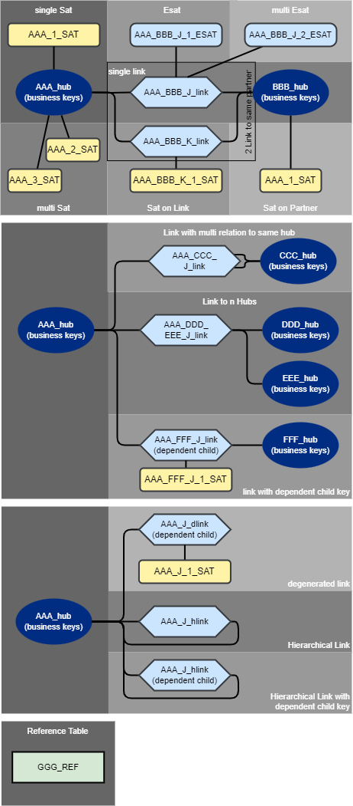
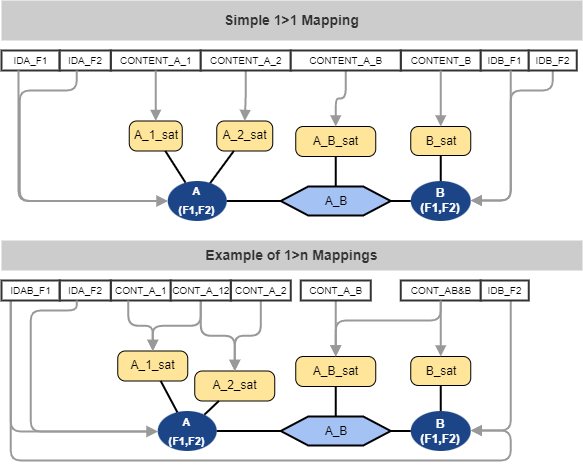

Data Vault - Model Topologies and basic source data mapping variations
==============================
(C) Matthias Wegner, cimt ag

Creative Commons License [CC BY-ND 4.0](https://creativecommons.org/licenses/by-nd/4.0/)

---------

To create a toolset for loading data into a data vault model, we need to
determine the completeness of the toolset. 
One aspect of variety is the different topoligies of a data vault model and the possibilites how the source fields are distributed over the target model.

This document focuses on the basic patterns.
The additonal complexity when having tables participating in multiple relations is 
discussed in [Catalog of field mappings in relations](./catalog_of_field_mappings_in_relations.md).

# Definitions
When describing the data we classify the elements as follows:

**field:** smallest element of source data. Will always be processed as a unit. Will be stored in one or multiple columns in the data vault.

**source row:** the fixed structure of fields, containing the data of one or more business-objects and their relation in a single row/unit. 

**table/hub/sat/link:** a table in the data vault model

**column:** a column in a table of the data vault model

**business key:** data, used to identify business objects

**table key/hub key/link key:** The join key of data vault model tables

**content:** Data that is not used for identification, and just stored in the data model

# Flat Structure Transformation
Data can be complex in multiple ways, especially when it comes to hierarchical data or document formats. The following approach uses the source data representation after its transformation into a single relational table model (all data is organized in rows, every row contains all fields). Hierarchical data formats might need multiple transformations (one for each array). In that case, each of these particular transformations will relate to one of the described patterns. 

# Informationtypes of data
To define the variety of mappings, it is necessary to clarify the types of information, represented by a field.

- Identification of an object
- Attribution or Measure of an object
- relation between objects (might be “self” relating)
- Attribution or Measure in a relation

*Note: The data vault main stereotypes map to this classification as follows.  hub=object / link=relation / satellite=attribution.*

*2nd Note: data that is stored in dependent child key columns of a link is also an identification type, since it is needed to identify attributes, that are attached to the satellite*

# Model Topologies

The following diagram provides a comprehensive overview about all 
basic topologies in data vault.

More complex models can always be broken down into a concatination of theses models. By providing a method, that describes all the basic topologies, any kind of model should be describable.

# Mapping variations

When classifying the mapping of the fields to the target tables and columns there are 2 perspectives 
- Field perspective
    - one field is mapped to one target column
    - one field is mapped to multiple target columns
- target column perspective    
    - a target column is addressed by only one field mapping
    - a target column is addressed by multiple field mappings

## field perspective
The field perspective is completly covered, when the DVPD provides syntax to
distribute fields to multiple tables and columns.

The following example provides the solution for some common topologies.

## target perspectice

Mapping multiple fields to the same target column is coupled to the concept of relations. It is discussed in [Catalog of field mappings in relations](./catalog_of_field_mappings_in_relations.md)

 

