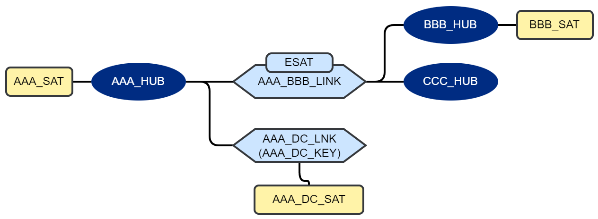
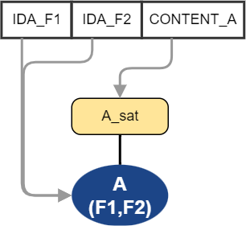
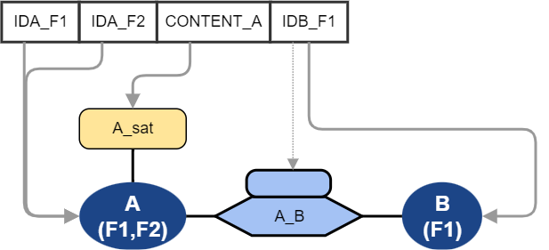
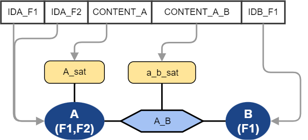
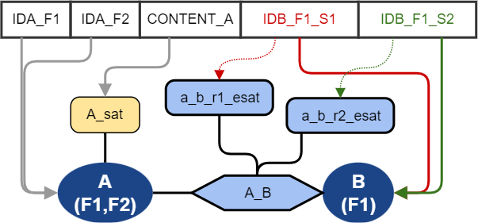
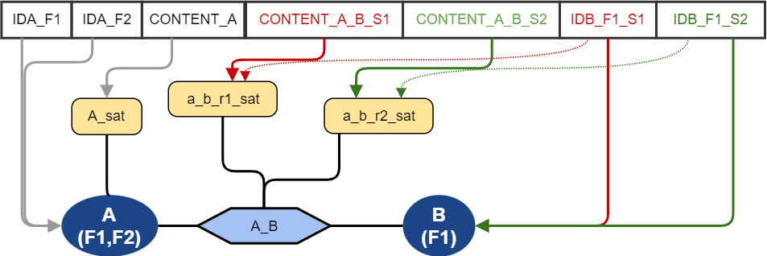
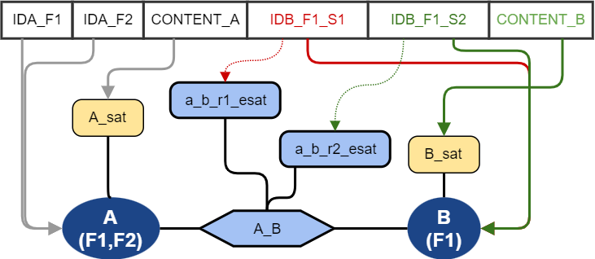
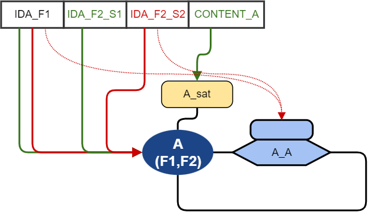
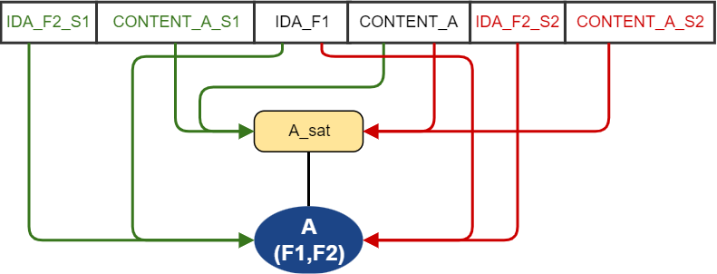

Data Vault - Catalog of field mappings in relations
==============================
(C) Matthias Wegner, cimt ag

Creative Commons License [CC BY-ND 4.0](https://creativecommons.org/licenses/by-nd/4.0/)

---------

To create a toolset for loading data into a data vault model, we need to
determine the completeness of the toolset. 
This article investigates the different possibilites how the source fields are mapped,
when multiple relations to the same hub are delivered in one row. Example to this
requirement are:
- order, referring the customer in different roles (delivery and invoice).
- flight, referring the start and destination airport

# Definitions
When describing the data we classify the elements as follows:

**field:** smallest element of source data. Will always be processed as unity. Will be stored in one or multiple columns in the data vault.

**source row:** the fixed structure of fields, containing the data of one or more business-objects and their relation in a single row/unit. 

**table/hub/sat/link:** a table in the data vault model

**column:** a column in a table of the data vault model

**business key:** data, used to identify business objects

**table key/hub key/link key:** The join key of data vault model tables

**content:** Data that is not used for identification, and just stored in the data model

# Property of the source data

## Tabularized
Data can be complex in multiple ways, especially when it comes
to hierarchical data or document formats. The following approach requires
the source data representation to be tabularized(all data is organized in Rows, every row contains all fields).
Hierarchical data formats might need multiple transformations(one for each array).

## Normalized
Tabularized data might not be fully normalized. 
This is given when there are table fields, that target the same 
data vault columns in the same relational context. 
(e.g. a row with (PersonID1, Name1, PersonID2, Name2) or (Airportid ,Runway1Length, Runway2Lenght)).
This kind of incoming datasets need to be normalized when extracting the data.

## Informationtypes of data
To define the variety of mappings, it is necessary to clarify the types of information, represented by a field.

- Identification of an object
- Attribution or Measure of an object
- relation between objects (might be “self” relating, hierarchical)
- Attribution or Measure in a relation

*Note: The data vault main stereotypes map to this classification as follows.
hub=object / link=relation / satellite=attribution.*

*2nd Note: data that is stored in dependent child key columns
of a link counts also as identification, since it is needed to address 
attributes, that are attached by the satellite*

# Model topologies 

This section identifies the data vault model topologies, that have different properties
regarding field mapping variations.
The topologies will be used later describe the different mapping scenarions. 

## Simple relations

As long, as there are no fields mapped to the same data vault column, 
the mapping stays simple, regardless of the complexity of the model topology.
For every table there is only one set of fields, that has to be used 
for hashing and loading. 

The following example will be used as base to work out the possible mapping variations.
It is designed to embed the most common simple models as a subset. By proving the 
completenes for this model, the coverage of DVDP of all simple models is shown.

## Multi relations to same hub 
For sources that provide multiple relations to the same object in their data, the 
data vault model must provide a proper structure.  
The following approaches are commonly applied to represent multiple relations
- hub keys to the same hub in a link for every kind of relation
- dedicated links for to the hub for every kind of relation
- a single link but dedicated effectivity satellites for every kind of relation

These approaches can also be mixed up (on purpose or due to legacy). 

*side note: When the relation type is declared in the data(not by the field structure),
this is a simple relation from the perspective of the data vault. 
The relation type is then stored in a satellite of the link.*

The models are created with 3 
relations to the same hub, even though this is a seldom constellation. 
This is necessary to prove completeness of the DVDP Syntax. Only with
3 Elements or more, it is possible to create subsets greater then 1 element.

Satellites are ommited in the diagram for simplicity.
There can be satellites on every hub and the effectivite satellites can 
be replaced by normal satellites, adding more content to the pure relation information.

### Multiple hub keys in link to the same hub (R)
This approach keeps the provided unit of work together but needs complete refactoring 
when another relation type needs to be added (See also the discussion of the concept
in chapter 4.4.4 of the Data Vault 2.0 Book of Dan Linstedt)
- The link contains a hub key for every relation type to the hub
- The hub keys must be named properly to explain the kind of relation, they represent
- Depending on the meaning, one relation might be the "main" object. This relation
might use the original hub key column name from the hub. Hierarchical links are
a common example for this situation.
- to calculate the link key, all business keys for the multie
referenced hub have to be assembled
- Link and Esat must be loaded once. 
- The multi referenced hub needs a load pass for every reference

### Dedicated link tables for every relation (L)
This approach is extendable without any impact to existing structures but might suffer
from breaking the unit of work, and creating "phantom relations".(See also the discussion of the concept
in chapter 4.4.4 of the Data Vault 2.0 Book of Dan Linstedt)
- the link key calculation only uses the business key fields for their specific relation
- every link contains one hub key for each linked hub
- every Link and Esat must be loaded once. 
- The multi referenced hub needs a load pass for every reference

### Single link table with relation specific effectivity satellites (E)
This method reduced the number of link tables , without loosing the flexibility 
of the multi link approach.  It suffers from the same "phanton relation" issue.  
- the link only contains one reference to each hub
- for every relation, there must be a separate the link key calculation only using
the business key fields for a specific relation
- every Esat must be loaded once 
- The link and the multi referenced hub needs a load pass for every reference

### Mix of multi related link and normal link (R+L) 
This model is a combinational edge case to challange the ablities of the
DVPD syntax and compiler. It might occur through model legacy.

### Relation specific effectivity satellites + parallel link (E+L)
This model is a combinational edge case to challange the ablities of the
DVPD syntax and compiler. It might occur through model legacy.

### Relation specific effectivity satellites + parallel link with 3rd hub (E+3)
This model is used to create an edge case for mapping combinations of attributes 
needed for the BBB_HUB.

## Out of scope edge cases
To keep the syntax of DVPD within a manageable complexity, some edge cases will be 
placed out of scope, since they are far from expected model requirements and can be
solved by other designs.

### mixing esat and multi referecence
Mixing different approaches at the same link is not supported. In the example 
two relations are expressed with two references to the hub and then are "multiplied"
by two more relation types represented by esat. This makes no sense in the combination, 
at least not under the constraint, that we always only load a single tabularized source  
data structure.

It might be an expression of the following:
- all 4 relations are a unit of work
- pairs of 2 relations are a unit of work and are modelled seperatly

# Relation participation

## Observerations and conclusions

1-Multiple relations are only possible with multiple sets of business keys field for the hub, they refer.
 2-From 1. -> every kind of multi relation to a hub needs business key field mappings, that are restricted to a relation
 3-hubs need to be loaded for every relation declared
 4-a link with multiple relations to the same hub, needs relation specific columns
 5-a link with multiple relations to the same hub, can only have satellites
that contribute to the relation set, provided in the link.
 7-effectivity satellites need to declare the relation they track
 8-satellites on links contribute to every relations, they have a field mapping
for 
 6-a link has to be loaded for every relation its satellites contribute to 
 9-links can only contribute to relations, that are declared in the  hubs they connect
 10-link satellites can only contribute to relations, the link can 
contribute in their parent
 11-Different dependent child keys for different relations can only be modeled with
relation specific links or relation specific satellites. (If only the dependend child key
appears multiple times in the source data set, this must be solveld by normalizing the 
data)

## Participation of fields
When mapping fields to a multi related model, there are the following possibilites 
how a field will contribute or participate 
to the modelled relations:
- to one or a subset of specific relations
- to all relations

Participation to a relation must be declared at every table mapping of the field.
If not declared, a field is considerd to participate only on the "main"(unnamed) relation.
To declare the participation on a subset, that contains the "main"(unnamed) relation
the syntax provides the reserved relation name "/".
A shortcut to participate to all relations is available with the syntax: "*".

## Participation of hubs
Hubs participate to all relations that contain a full set of fields mapped to the 
business keys.

- The full set of business keys is determined by the largest mapped set of all relations.
- relations with different or incomplete column outcome will fail the consistency check
- relations without any contribution by a link/link satellite will trigger a warning
since there might be unnecessary data loaded.

This concept include the simple case, since fields without any relation declaration  belong to the 
main"(unnamed) relation .

## Participation of links
How to determine the participation of link on relations 
depends on the modelling approach. Therefore it contains a more complex ruleset:
- when having explicit declarations in the parent mapping, links are restriced to that list
- without an explicit declaration, links collect every relation name, found in the hubs
- 
links  Links participate to all relations that are declared

## Syntax consistency rules
In the mapping of a field to a...
- **hub** the relation names, must be known from parent reference of a link 
- **link** the relation name, must be known in a parent reference to a hub
- **sat** the relation name, must be known in a parent reference to a hub,
when the link declares reference names. For links without reference name declarations,
the name 

Fields mapped to a link 
 

____

# Taxonomy 

## Single relation scenarios

### (1) M1 Single main object with content only 
The source row contains

- 1 set of fields with the business key of object A
- 1 set of fields with content of object A

Example source: Table with product data

### (2) Single main object with content divided to two satellites

The source row contains

- 1 set of fields with the business key of object A
- 1 set of fields with content of object A, some for sat1 , some for sat2 and
somefor both

### (1P1-E) M1E1 Single main object with partner relation 
The source row contains

- 1 set of fields with the business key of object A
- 1 set of fields with content of object A
- 1 set of fields with the business key of object B

Example source: Table with employee data including the current department he is working

### (1P1Sh-E)M1E1P1 Single main object and single partner object,both with content
The source row contains

- 1 set of fields with the business key of object A
- 1 set of fields with content of object A
- 1 set of fields with the business key of object B
- 1 set of fields with content of object B

Example source: Table with data of manufactured items and the product+product description, the item belongs to

### (1P1-Sl) M1LS1 Single main object with content on single relation
The source row contains

- 1 set of fields with the business key of object A
- 1 set of fields with content of object A
- 1 set of fields with the business key of object B
- 1 set of field with content about relation of A and B

### (1P1-DE) M1En Single main object with dependend child key relation
The source row contains

- 1 set of fields with the business key of object A
- 1 set of fields with content of object A
- more then 1 set of fields with the business key of object B representing another or the same relation

## Multiple relations between 2 hubs

### Single main object with multiple relations, separated businieskeys
The source row contains

- 1 set of fields with the business key of object A
- 1 set of fields with content of object A
- 2 set of fields with the business key of object B representing 
different relations

Example source: Table with contract data including the id of the person,that receives the delivery and the id of the person that pays the bill

#### (1P1-R2E) Modeled with multiple relations from 1 link

#### (1P1-E2) Modeled with 2 effectivity satellites

#### (1P1-E2) Modeled with 2 links and

###  (1P1-Sl2) M1LSn Single main object with content on multiple relations
The source row contains

- 1 set of fields with the business key of object A
- 1 set of fields with content of object A
- 2 sets of fields with the business key of object B representing 
different relations
- 2 sets of field with content about different the relations of A and B

Example source: Table with contract data including the id and current delivery rating of the person,that receives the delivery and the id and current credibilty rating of the person that pays the bill

### M1E1P1 Single main object and single partner object, both with content
The source row contains

- 1 set of fields with the business key of object A
- 1 set of fields with content of object A
- 1 set of fields with the business key of object B
- 1 set of fields with content of object B

Example source: Table with data of manufactured items and the product+product description, the item belongs to

### M1EnP1 Single main object with multiple relations and content for one partner
The source row contains

- 1 set of fields with the business key of object A
- 1 set of fields with content of object A
- 2 or more sets of fields with the business key of object B representing another or the same relation
- 1 set of fields with content of object B for one specific set of business keys

Example source: Table with contract data including the id, name and current delivery rating of the person,that receives the delivery and the id and current credibilty rating of the person that pays the bill

### MR1 single main object with self relation
The source row contains

- 1 set of fields with the business key of object A
- 1 set of fields with content of object A
- 2nd set of fields with the business key of object A (may share some field of first set) 

Example source: Table with company data and the id of the company that owns this company

### Mn Multiple object sets 
The source row contains

- 2 or more sets of dedicated businesskey fields for every delivered object
- 2 or more sets of dedicated content fields for every delivered object
- optionally: shared set of fields with businesskey data, that is the same for all objects
- optionally: shared set of fields with content data, that is the same for all objects

## Combination Matrix

The following table shows all of the upper combinations in a comprehensive way.

| business key fieldsets of object A(main object) | Content fieldsets of object A | business key fieldsets of object B(related object) | Content fieldsets of B  | Content fieldsets for relation | Estimated ocurrence in regular projects | Covered by pattern  |
|:---------------------------------------------:|:-----------------------:|:-------------------------------:|:-----------------------:|:------------:|:-----------:|---------------------|
|                        1                        |                1                 |                         0                          |            0            |               0                |                   15%                   | M1                  |
|                        1                        |                1                 |                         1                          |            0            |               0                |                   55%                   | M1E1                |
|                        1                        |                1                 |                         1                          |            0            |               1                |                   10%                   | M1LS1               |
|                        1                        |                1                 |                         1                          |            1            |               0                |                   20%                   | M1E1P1              |
|                        1                        |                1                 |                         1                          |            1            |               1                |                   <1%                   | M1LS1+M1E1P1        |
|                        1                        |                1                 |                         2+                         |            0            |               0                |                   2%                    | M1En                |
|                        1                        |                1                 |                         2+                         |            0            |       same as ident of B       |                   <1%                   | M1LSn               |
|                        1                        |                1                 |                         2+                         |            1            |               0                |                   <1%                   | M1EnP1              |
|                       2+                        |                1                 |                         0                          |            0            |               0                |                   2%                    | MR1                 |
|                       2+                        |        same as ident of A        |                         0                          |            0            |               0                |                   <1%                   | Mn                  |

