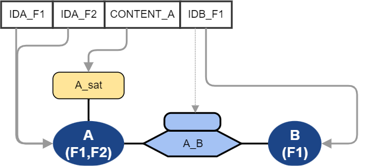
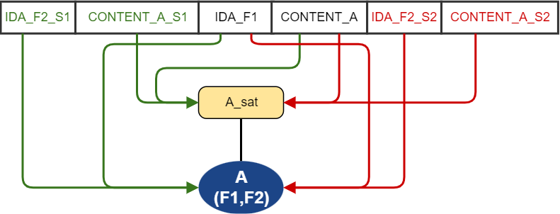

Data Vault - Source Data Mapping Taxonomy
==============================
(C) Matthias Wegner, cimt ag

Creative Commons License [CC BY-ND 4.0](https://creativecommons.org/licenses/by-nd/4.0/)

---------

To create a toolset for loading data into a data vault model, we need to determine the completeness of the toolset. 
Beside adressing the variety of source technologies and formats and the different data vault stereotypes we also need to fulfill  the requirements coming from the pure arrangement of data in the incoming data stream and how it must be distributed to the target model. 
Generic modelling and loading approaches need to be able to provide at least the most common patterns. Universal descriptions like Data Vault Pipeline Description Standard (DVPD) should be able to cover all aspects.

In the follwing, the possible basic mapping patterns are described. 

# Definitions
When describing the data we classify the elements as follows:

**field:** smallest element of source data. Will always be processed as unity. Will be stored in one or multiple columns in the data vault.

**source row:** the fixed structure of fields, containing the data of one or more business-objects and their relation in a single row/unit. 

**table/hub/sat/link:** a table in the data vault model

**column:** a column in a table of the data vault model

**business key:** data, used to identify business objects

**table key/hub key/link key:** The join key of data vault model tables

**content:** Data that is not used for identification, and just stored in the data model

# Flat Structure Transformation
Data can be complex in multiple ways, especially when it comes to hierarchical data or document formats. The following approach uses the source data representation after its transformaion into a single relational table model(all data is organized in Rows, every row contains all fields). Hierarchical data formats might need multiple transformations(one for each array). In that case, each of these particular transformations will relate to one of the described patterns. 

# Informationtypes of data
To define the variety of mappings, it is necessary to clarify the types of information, represented by a field.

- Identification of an object
- Attribution or Measure of an object
- relation between objects (might be “self” relating, hierarchical)
- Attribution or Measure in a relation

*Note: The data vault main stereotypes map to this classification as follows.  hub=object / link=relation / satellite=attribution.*

*2nd Note: data that is stored in dependent child key columns of a link is also an identification type, since it is needed to identify attributes, that are attached with the satellite*

# Basic Taxonomy
The basic taxonomy describes the following possibilities, how fields can be **part of the same row**

- There must be at least one set of fields to describe the objects. 
- There might be multiple sets of fields to describe objects of the same class (e.g. a child and its parent)
- There might be multiple relations between the same partners corresponding to different roles/responsibilities in the relation (e.g. driver of a car and the owner of a car)

### M1 Single main object with content only
The source row contains

- 1 set of fields with the business key of object A
- 1 set of fields with content of object A

Example source: Table with product data

### M1E1 Single main object with partner relation 
The source row contains

- 1 set of fields with the business key of object A
- 1 set of fields with content of object A
- 1 set of fields with the business key of object B

Example source: Table with employee data including the current department he is working 

### M1En Single main object with multiple relations
The source row contains

- 1 set of fields with the business key of object A
- 1 set of fields with content of object A
- more then 1 set of fields with the business key of object B representing another or the same relation

Example source: Table with contract data including the id of the person,that receives the delivery and the id of the person that pays the bill

### M1LS1 Single main object with content on single relation
The source row contains

- 1 set of fields with the business key of object A
- 1 set of fields with content of object A
- 1 set of fields with the business key of object B
- 1 set of field with content about relation of A and B

Example source: Table with billing data, the id of the sold object and the price it was sold

### M1LSn Single main object with content on multiple relations
The source row contains

- 1 set of fields with the business key of object A
- 1 set of fields with content of object A
- 2 or more sets of fields with the business key of object B
- 2 or more sets of field with content about different relations of A and B

Example source: Table with contract data including the id and current delivery rating of the person,that receives the delivery and the id and current credibilty rating of the person that pays the bill

### M1E1P1 Single main object and single partner object, both with content
The source row contains

- 1 set of fields with the business key of object A
- 1 set of fields with content of object A
- 1 set of fields with the business key of object B
- 1 set of fields with content of object B

Example source: Table with data of manufactured items and the product+product description, the item belongs to

### M1EnP1 Single main object with multiple relations and content for one partner
The source row contains

- 1 set of fields with the business key of object A
- 1 set of fields with content of object A
- 2 or more sets of fields with the business key of object B representing another or the same relation
- 1 set of fields with content of object B for one specific set of business keys

Example source: Table with contract data including the id, name and current delivery rating of the person,that receives the delivery and the id and current credibilty rating of the person that pays the bill

### MR1 single main object with self relation
The source row contains

- 1 set of fields with the business key of object A
- 1 set of fields with content of object A
- 2nd set of fields with the business key of object A (may share some field of first set) 

Example source: Table with company data and the id of the company that owns this company

### Mn Multiple object sets 
The source row contains

- 2 or more sets of dedicated businesskey fields for every delivered object
- 2 or more sets of dedicated content fields for every delivered object
- optionally: shared set of fields with businesskey data, that is the same for all objects
- optionally: shared set of fields with content data, that is the same for all objects

## Combination Matrix

The following table shows all of the upper combinations in a comprehensive way.

| business key fieldsets of object A(main object) | Content fieldsets of object A| business key fieldsets of object B(related object) | Content fieldsets of B|Content fieldsets for relation | Estimated ocurrence in regular projects | Covered by pattern |
| :----: | :----: | :----: | :----: | :----: | :----: | ---- |
| 1 | 1 | 0 | 0 | 0 | 15% | M1 |
| 1 |1|1|0|0|55%|M1E1 |
| 1 |1|1|0|1|10%|M1LS1|
| 1 |1|1|1|0|20%|M1E1P1|
| 1 |1|1|1|1|<1%|M1LS1+M1E1P1|
| 1 |1|2+|0|0|2%|M1En |
| 1 |1|2+|0|same as ident of B|<1%|M1LSn|
| 1 |1|2+|1|0|<1%|M1EnP1|
| 2+ |1|0|0|0|2%|MR1 |
| 2+ |same as ident of A|0|0|0|<1%|Mn|

