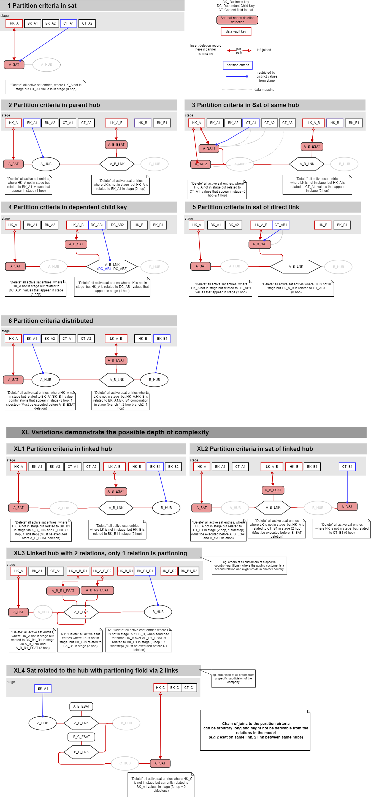

# Deletion detection catalog

(C) Matthias Wegner, cimt ag

Creative Commons License [CC BY-ND 4.0](https://creativecommons.org/licenses/by-nd/4.0/)

---------

Deletion detection by comparing the data vault content against the complete source data might become very expensive for large datasets or is even impossible, when the source only delivers excerpts of its data through the interface.

In such cases a deletion detection, that is restriced to a specific partition of the data, will provide a  way to maintain a correct image of the source data in the data vault.

There are multiple ways and scenarios to process a partioned deletion. That's why we need a more deeper investigation.

The basic prerequisits for using a partitioned deletion detection are:
- partitions are identified by values in fields, that are stored in the data vault model
- the incoming increment of data contains all rows for all partitions, that are mentioned in the increment (or in pseudo sql language: The increment has always a complete set of rows for all values for SELECT DISTINCT partitioning columns FROM increment)

The procedure for a single satellite is as follows (please read it slow and with precision):
- select all active "keys" from the satellite that belong to the partition 
    - Join from the satllite to the data vault tables, that contain the partitioning fields
	- filter the partitioning field to the set of values in the source increment
- create deletion records for all "keys" of the target satellit, that are missing in the source increment
- apply enddating (when used)

Selecting all active keys that belong to the partition can be a complex task, depending on the distribution of the partitioning columns in the data vault model.
The following picture shows examples of common scenarios 



# Scenario discussions
For naming conventing in these examples see appendix

### 1 Partition criteria in satellite
Needed Tables: only A_SAT

SQL to determine keys in partition:
```
    SELECT HK_A 
    FROM A_SAT
    WHERE CT_A1 IN 
	   (SELECT DISTINCT CT_A1 
        FROM  STAGE_TABLE )
		AND A_SAT.META_VALID_BEFORE=far_future_date()
		AND NOT A_SAT.META_IS_DELETED
```	

### 2 Partition criteria in parent hub

#### A_SAT Deletion
Needed Tables:  A_SAT and A_HUB

SQL to determine A_SAT keys in partition:
```
    SELECT HK_A 
    FROM A_SAT
    JOIN A_HUB ON A_HUB.HK_A = A_SAT.HK_A
    WHERE BK_A1 IN 
	   (SELECT DISTINCT BK_A1 
        FROM  STAGE_TABLE )
       AND A_SAT.META_VALID_BEFORE=far_future_date()
       AND NOT A_SAT.META_IS_DELETED
```	

#### A_B_ESAT Deletion
Needed Tables:  A_B_ESAT, A_B_LNK and A_HUB

SQL to determine A_B_ESAT keys in partition:
```
    SELECT LK_A_B 
    FROM A_B_ESAT
    JOIN A_B_LNK USING (LK_A_B)
    JOIN A_HUB USING (HK_A)
    WHERE BK_A1 IN 
	   (SELECT DISTINCT BK_A1 
        FROM  STAGE_TABLE )
       AND A_B_ESAT.META_VALID_BEFORE=far_future_date()
       AND NOT A_B_ESAT.META_IS_DELETED
```	

### 3 Partition criteria in sat of same hub

#### A_SAT2 Deletion
Needed Tables:  A_SAT2 and A_SAT1

SQL to determine A_SAT2 keys in partition:
```
    SELECT HK_A 
    FROM A_SAT2
    JOIN A_SAT1 ON A_SAT1.HK_A = A_SAT2.HK_A
               AND A_SAT1.META_VALID_BEFORE=far_future_date()
               AND NOT A_SAT1.META_IS_DELETED
    WHERE CT_A1 IN 
	   (SELECT DISTINCT CT_A1 
        FROM  STAGE_TABLE )
       AND A_SAT2.META_VALID_BEFORE=far_future_date()
       AND NOT A_SAT2.META_IS_DELETED
```

#### A_B_ESAT Deletion
Needed Tables:  A_B_ESAT, A_B_LNK and A_SAT1

SQL to determine A_B_ESAT keys in partition:
```
    SELECT LK_A_B 
    FROM A_B_ESAT
	JOIN A_B_LNK USING (LK_A_B)
    JOIN A_SAT1 ON  A_SAT1.HK_A = A_B_LNK.HK_A
               AND A_SAT1.META_VALID_BEFORE=far_future_date()
               AND NOT A_SAT1.META_IS_DELETED
    WHERE CT_A1 IN 
	   (SELECT DISTINCT CT_A1 
        FROM  STAGE_TABLE )
       AND A_B_ESAT.META_VALID_BEFORE=far_future_date()
       AND NOT A_B_ESAT.META_IS_DELETED
```	

### 4 Partition criteria in dependent child key

#### A_SAT Deletion
Needed Tables:  A_SAT, A_B_LNK and A_B_ESAT

SQL to determine A_SAT2 keys in partition:
```
    SELECT HK_A 
    FROM A_SAT
    JOIN A_B_LNK ON A_B_LNK.HK_A = A_SAT.HK_A
	JOIN A_B_ESAT ON A_B_ESAT.LK_A_B = A_B_LNK.LK_A_B
               AND A_B_ESAT.META_VALID_BEFORE=far_future_date()
               AND NOT A_B_ESAT.META_IS_DELETED
    WHERE DC_AB1 IN 
	   (SELECT DISTINCT DC_AB1
        FROM  STAGE_TABLE )
       AND A_SAT.META_VALID_BEFORE=far_future_date()
       AND NOT A_SAT.META_IS_DELETED
```

#### A_B_ESAT Deletion
Needed Tables:  A_B_ESAT, A_B_LNK 

SQL to determine A_B_ESAT keys in partition:
```
    SELECT LK_A_B 
    FROM A_B_ESAT
	JOIN A_B_LNK USING (LK_A_B)
    WHERE DC_AB1 IN 
	    (SELECT DISTINCT DC_AB1 
        FROM  STAGE_TABLE )
       AND A_B_ESAT.META_VALID_BEFORE=far_future_date()
       AND NOT A_B_ESAT.META_IS_DELETED
```	

### to be continued...

# Appendix

### Modelling convention
Satellites are enddated. The currently active rows are marked by setting the enddate column to a constant value in the far future.

### Naming convention
- Data Vault table stereotype is provided as postfix 
- Names of hash keys consist of a prefix followed by the table the hash belongs to
    - HK_ prefix indicates the hash key of a hub
    - LK_ prefix indicates the hash key of a link
- table names of satellites begin with the table name of their parent
- table names of links contain all table names of the hubs, the link is connecting
