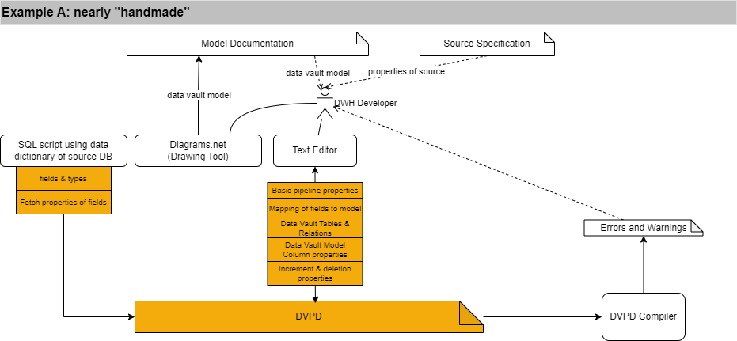
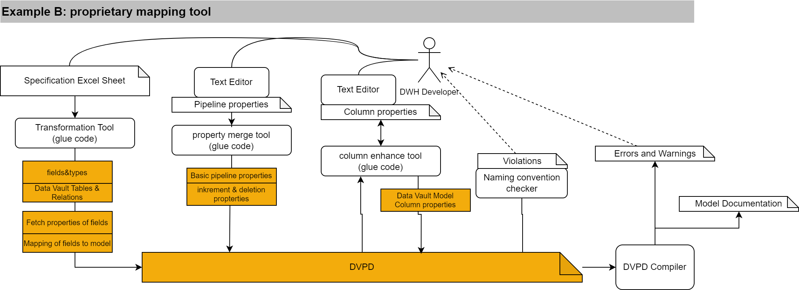
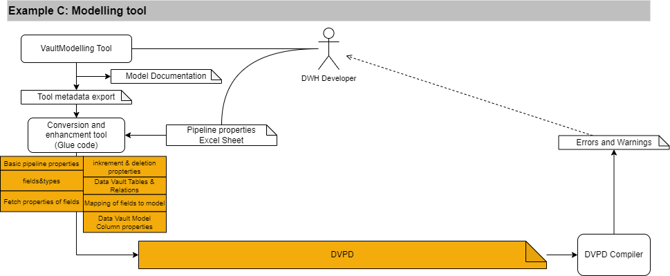
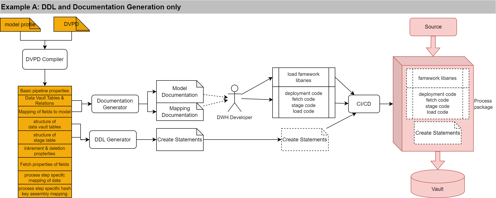
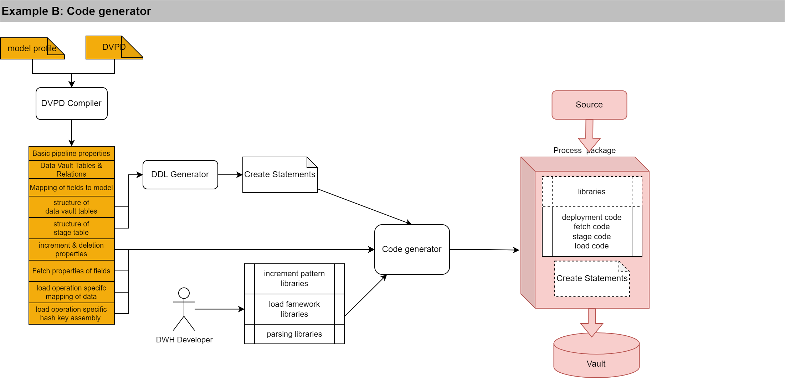
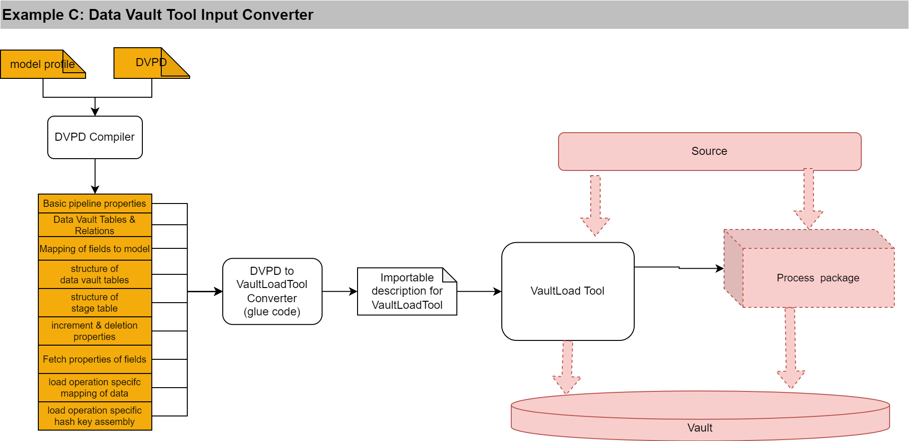

DVPD development workflow scenarios
=======================================================

## Licence and Credits

(C) Matthias Wegner, cimt ag

Creative Commons License [CC BY-ND 4.0](https://creativecommons.org/licenses/by-nd/4.0/)

# Introduction
The Data Vault Pipeline Description allows many variations in how to set up the workflow and toolchain for an implementation of data vault loading processes. In the following, we describe some example scenarios, to give an idea about the possibilities.

## About the main phases: Analysis/Design and implementation
In the implementation  workflow for data loading processes, there are two main phases: 

- Phase 1: Gather all necessary knowledge about the source data and design the data vault structure based on that knowledge. 
- Phase 2: Implement database objects and the loading process. Test and deploy the process.

DVPD is designed to gather all information during phase 1 and be the single source of information for phase 2. The following examples focus either on phase 1 or 2. By using DVPD, all phase 1 examples are compatible to all phase 2 examples. 

# Phase 1: DVPD Creation Scenarios

Phase 1 contains analysis and decision making on the source data. There might be products out there, that provide all necessary functions in one tool to support this, but mostly this workflow is "stitched" together by using multiple tools. 
The examples try to emphasize this approach. They can only scratch  the whole potential of this approach. So feel free to think out of the box and combine, what ever you need and like to assemble a completed DVPD for a loading process.

## Example A: nearly "Handmade"

- The sources are mainly database tables or views from the operational systems. To accelerate the process of listing all source fields, a script can use the database dictionary of the source system to generate the list of fields in DVDP syntax.
- Analysis of the source data (business keys, uniqueness) is done with basic SQL queries by the data engineers and documented in a source specification document
- With the analysis result in mind, the data engineer creates the data vault model, documented in a diagram
- the diagram is translated into the DVDP model syntax by the data enginneer and merged with the generated field list
- the generated field list is extended with the mapping to the data vault model
- additional properties to guide the access, parsing and increment logic are added to the DVPD

Errors during the compiling of the final DVPD will lead to corrections in the DVPD document.

## Example B: proprietary mapping tool

In this example, a team of business analysts provides the whole specification of the source, including primary key and foreign key relations of the source object.
This information is given to the data engineers in a standardized Excel sheet. The workflow is as follows:
- the Excel Sheet with the source object declaration is provided
- a transformation tool (script) translates the provided information into a draft DVPD, incuding a data vault data model
- in parallel a data engineer declares the technical properties for the pipeline in a separate shortened DVPD document (Pipeline properties)
- With a merge script, the draft DVPD gets enhanced with the pipeline properties
- In case some data vault columns and mappings need more technical declaration, this will be provided in a third shortened DVPD and merged with a script into the now completed DVPD document.
- For a first quality check, a script will parse and check the tables and column names, declared in the DVPD. Convention or consistency violations are reported to the data engineers and need to be fixed
- Finally, the DVPD gets compiled. Errors and warnings need to be managed and fixed before releasing the DVPD into the implementation phase
- Successful compilation of a DVDP will generate a model diagram and a mapping specification table, that are copied into the central documentation tool

By orchestrating all the steps in a CI workflow, the upper steps take an initial effort of 15 minutes. Corrections are applied and verified in minutes. Depending on the documentation tool, even the update of the central documentation can be automated.

## Example C: Modelling tool

In case you have a convenient modelling tool, that is capable of reading source data structures and describe the mapping of the source data to a data vault model, the following workflow might be your choice.
- in the modelling tool
    - Read and analyze source data structure with the modeling tool
    - Create or extend the data vault model accordingly
    - configure the mapping 
	- add DVPD property data in custom fields, when possible
	- Export the model and the mapping in a processable format
- Add DVPD specific properties, that can't be stored in the modelling tool in a separate document (e.g. an excel sheet)
- By using a converter process (glue code), convert the exported model and mapping into a DVPD and merge all seperately defined DVPD properties
- compile the DVPD and manage and fix errors

# Phase 2: DVPD Processing Scenarios

With the complete description of the source structure, target model and field mapping, an automated implementation/generation of the loading processes can be achieved. The level of automation depends on the capabilites of the used processing tools. The following scenarios describe different levels of automation.

## Example A: DDL and Documentation generator only

- the result of the DVPD compiler is only used to generate all DDL statements
- load processes are implemented manually by copy & adapt, supported by
    - a set of libraries
    - standardized implementation patterns
    - code snippets created from the DVPD Compiler results by a generator 
- documentation is done manually in a general documentation tool. To keep consistency, documentation snippets are generated from the DVPD and copied into the documentation tool

This approach has the most flexibilty when facing variations of incoming data formats, transportation protocol and incremental logic. It will mostly be used in small projects or projects with a high or hardly predictable number of input formats.

## Example B: Code Generator
This is an evolution of the Example A, but instead of providing only code snippets, the generator creates the complete code. Adaption to new formats and technologies must be achieved by providing new libraries to the generator.

Generation of documentation is not needed for the implementation process (It is still good practice to support analysis and linage investigation).

Implementation of general libraries takes more effort in testing and needs higher discipline from the maintainting developers. Therefore it is only efficient for projects with a high number of source objects, that follow the same formats, protocols and increment pattern.

## Example C: Data Vault Tool Input Converter

In case there is a product available, that allows implementation of processes by providing specific metadata, it might be feasable to convert the result of the dvpd compiler into the input metadata of the tool. 

Depending on the type of tool, the processes are run by the tool or the tool generates the processing code.

# There is no "works for all" solution, but some bad
As mentioned in the introduction, there is no best option, that fits for all projects. It depends on the sprectrum of sources, the available budget, the teamsize and the toolstack already in place or favoured.

Since the DVPD itself is an enclosed artifact containing all information, one might be tempted to use it as the final deployment package and rely on the consistency of an execution engine, that compiles the dvpd and executes the result instantly.

**It is not recommended to include the DVDP compiler in the code generator**.

**Don't build monolithic architectures** 

**Only small independent modules with a distinct set of responsibilities and functions stay maintainable and testable**

This is already valid for all tools of the implementation workflow but especially for the final loading processes. 
Keep in mind, that retesting of released loading processes should be highly avoided. This is why most examples create packages for deployment, that are decoupled from all future code changes in the development. Feeding the DVDP to a monolithic execution engine puts all implemented pipelines to risk of failiure when the engines gets changed (e.g. update). 
In the worst case, this might corrupt your data vault.

 

