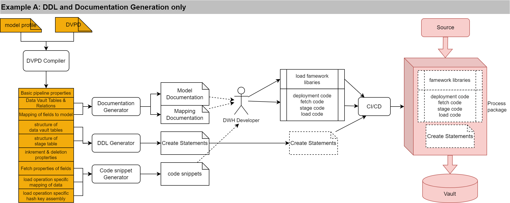

DVPD development workflow scenarios
=======================================================

## Licence and Credits

(C) Matthias Wegner, cimt ag

Creative Commons License [CC BY-ND 4.0](https://creativecommons.org/licenses/by-nd/4.0/)

# Introduction
The Data Vault Pipeline Description allows many variations, how to set up the workflow and toolchain for implementation of data vault loading processes. In the following, we describe some possible solutions, to give an idea about the possibilites.
The primary motiviation is the fact, that different projects need different toolsets, depending on size, technology, team knowledge, history and more. 
DVPD should give you the freedom to create a toolchain, tailored to the needs of your project while staying open for later improvements.

## The main phases: Analysis/Design and implementation
In the implementation workflow, there are two main phases: 

- Phase 1: Gather all necessary knowledge about the source data and design the data vault structure based on that knowledge. 
- Phase 2: Implement database objects and the loading process. Test and deploy the process.

DVPD is designed to gather all information during phase 1 and be the single source of information for phase 2. Thats with examples provided here, focus either phase 1 or 2. By using DVPD, all phase 1 examples are compatible to all phase 2 examples.

# Phase 1: DVPD Creation Scenrios

## Example A: nearly "Handmade"

In this project, all work was done by a small group of data engineers. The sources are mainly database tables or views from the operational systems. To accelerate the process of writing down all source fields, a script was created to generate the list of fields of a table from the data dictionary of the source system.

After some data analysis in the source data, the data vault model was extendet with the necessary tables. This was documented in a data vault model diagramm in the model documentation. Also the general properties of the source, have been documented in a source specifiation document.

Finally the draft of the generated field list was extended by the definition of the specifiedn data model, the mapping of the fields to the model and the necessary properties of the pipeline, needed to select corretd the code generator or execution modules that can handle the source data protocol, increment logic and parsing.

Errors during the compiling of the final DVPD will lead to corrections in the DVPD document.

## Example B: proprietary mapping tool

In this project, a team of business analysts provides the whole specification of the source , including primary key and foreign key relations of the source object.
This information is provided to the DWH Dataengineers in a standardizes Excel sheet. The workflow is as follows:
- the Excel Sheet is provided
- a transformation tool (script) translates the provided information into a draft DVPD
- in paralell a DWH Data Engineer declare the technical properties for the pipeline in a separate shortened DVPD document (Pipeline properties)
- With a merge script, the draft DVPD gets enhanced with the pipeline properties
- Only in case, some data vault columns and mappings need more technical declaration, this will be provided in a third shortened DVPD and merged with a script into the now completed DVPD document.
- As a fist quality check, a script will parse an check the tables and column names, declared in the DVPD. Violations are reported to the DWH Data Engineneers and need to be fixed
- Finally the DVPD gets compiled. Errors and Warnings need to be managed and fixed before releasing the DVPD into the implementation Phase
- Successful compilation of a DVDP will generate a model diagram and a mapping specification table, that are copied into the central documentation tool

By orchestrating all the steps in a CI workflow, the upper steps take an initial effort of 10 Minutes. Corrections are applied and verified in Minutes. Depending on the documentaion tool, even the update of the central documentation can be automated.

## Example C: Modelling tool

Despite you have a convenient modelling tool, that is capable of reading source data structures and descibe the mapping of the source data to a data vault model, the following workflow might be your choice.
- in the modelling tool
    - Read and analyze source data structure with the modeling tool
    - Create or extend the data vault accordingly
    - configure the mapping 
	- add DVPD property data in custom fields, when possible
	- Export the modell and the mapping into a processible format
- Add DVPD specific properties, that can't be stored in the modelling tool in a separate document (e.g. an excel sheet)
- By using a converter process (glue code), convert the exported mapping ans model into a DVPD and merge all seperatly defined DVPD properties
- compile the DVPD and manage and fix errors

 

